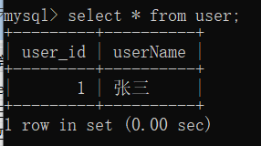
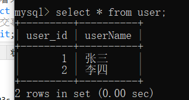
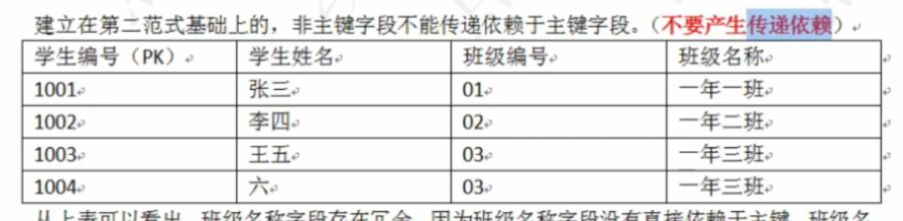
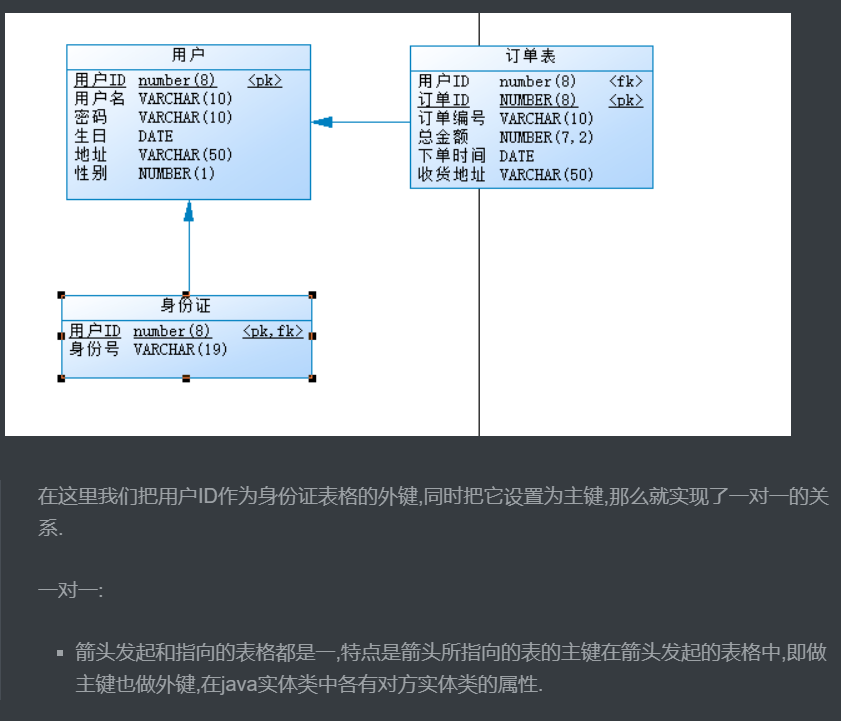

# Mysql

# 基础

## 1、查看表中数据

```sql
desc tablename;
```

## 2、limit，分页查询

> 语法：
>
> - limit startIndex,length

```sql
--limit查询，limmt是最后执行的语句。
SELECT ename,sal from emp order by sal desc limit 0,5;
--查询4到9名的员工
SELECT ename,sal from emp order by sal desc limit 0,5;
--通用的标准分页
--pageSize 3，每页的pageNo = (pageNo - 1 ) * pageSize
```

## 3、数据库引擎

> 数据库中的各表均被（在创建时）指定的存储引擎来处理，表的存储方式。
> 服务器可用的引擎依赖于以下因素
>
> - MYSQL的版本
> - 服务器在开发时如何被配置
> - 启动选项
>
> 为了了解当前服务器有哪些引擎可以用，可使用SHOW ENGINES语句
>
> ```sql
> --查看数据库引擎
> show engines;
> ```

```sql
--完整的建表语句
CREATE TABLE `emp` (
  `EMPNO` int(11) NOT NULL,
  ......
) ENGINE=InnoDB DEFAULT CHARSET= 
```

> 常见的存储引擎
>
> 存储引擎这个名字只有在mysql有，（Oracle中也有对应的方式，但是不叫作存储引擎，Oracle中没有特殊的名字，就是叫做“表的存储方式”）
>
> mysq支持很多种存储引擎，每一个存储引擎都对应了一种不同的存储方式。每一个存储引擎都有自己的优点，需要在合适的时机选择合适的存储引擎。

```sql
show engines \G; --\G是格式化输出
--支持9个存储引擎
*************************** 1. row ***************************
      Engine: InnoDB --默认的存储引擎
     Support: DEFAULT
     Comment: Supports transactions, row-level locking, and foreign keys
Transactions: YES
          XA: YES
  Savepoints: YES
*************************** 2. row ***************************
      Engine: MRG_MYISAM
     Support: YES
     Comment: Collection of identical MyISAM tables
Transactions: NO
          XA: NO
  Savepoints: NO
*************************** 3. row ***************************
      Engine: MEMORY
     Support: YES
     Comment: Hash based, stored in memory, useful for temporary tables
Transactions: NO
          XA: NO
  Savepoints: NO
*************************** 4. row ***************************
      Engine: BLACKHOLE
     Support: YES
     Comment: /dev/null storage engine (anything you write to it disappears)
Transactions: NO
          XA: NO
  Savepoints: NO
*************************** 5. row ***************************
      Engine: MyISAM
     Support: YES
     Comment: MyISAM storage engine
Transactions: NO
          XA: NO
  Savepoints: NO
*************************** 6. row ***************************
      Engine: CSV
     Support: YES
     Comment: CSV storage engine
Transactions: NO
          XA: NO
  Savepoints: NO
*************************** 7. row ***************************
      Engine: ARCHIVE
     Support: YES
     Comment: Archive storage engine
Transactions: NO
          XA: NO
  Savepoints: NO
*************************** 8. row ***************************
      Engine: PERFORMANCE_SCHEMA
     Support: YES
     Comment: Performance Schema
Transactions: NO
          XA: NO
  Savepoints: NO
*************************** 9. row ***************************
      Engine: FEDERATED
     Support: NO
     Comment: Federated MySQL storage engine
Transactions: NULL
          XA: NULL
  Savepoints: NULL
```

### 1、常见的存储引擎

#### 1、MyISAM

> --mysql最常用的存储引擎
>
> ```sql
> *************************** 5. row ***************************
>       Engine: MyISAM
>      Support: YES
>      Comment: MyISAM storage engine
> Transactions: NO  --不支持事务
>           XA: NO
>   Savepoints: NO
> ```
>
> 使用三个文件来存储文件：
>
> - 格式文件 -- 存储表结构的定义（mytable.frm）
> - 数据文件 -- 存储表行的内容 （mytable.MYD）
> - 索引文件 -- 存储表上的索引 （mytabl.MYI）
>
> 灵活的AUTO_INCREMENT字段处理
>
> 可转化为压缩、只读表来节省空间。

#### 2、InnoDB

> InnoDB存储引擎是mysql默认的缺省引擎
>
> ```sql
> *************************** 1. row ***************************
>       Engine: InnoDB
>      Support: DEFAULT
>      Comment: Supports transactions, row-level locking, and foreign keys
> Transactions: YES
>           XA: YES
>   Savepoints: YES
> ```
>
> 它管理的表具有以下主要特征：
>
> - 每个InnoDB表在数据库中以.frm格式文件表示
> - InnoDB表空间tablespace被用于存储表的内容
> - 提供一组用来记录事务性活动的日志文件
> - 用COMMIT{提交}、SAVEPOINT及ROLLBACk{回滚}支持事务处理
> - 提供全ACID兼容
> - 在mysql服务器崩溃后提供自动恢复
> - 多版本（MVCC）和行级锁定
> - 支持外键及引用的完整性，包括级联删除和更新

#### 3、MEMORY

> ```sql
> *************************** 3. row ***************************
>       Engine: MEMORY
>      Support: YES
>      Comment: Hash based, stored in memory, useful for temporary tables
> Transactions: NO
>           XA: NO
>   Savepoints: NO
> ```
>
> 缺点：不支持事务。数据容易丢失。因为所有的数据和索引都是存储在内存当中。断电即失。
> 优点：查询速度最快。
> 以前叫作Heap

## 习题

> 查询出部门工资最高的人
>
> ```sql
> --子查询
> SELECT
> 	e1.*,
> 	a.* 
> FROM
> 	( SELECT max( sal ) maxsal, e.deptno FROM emp e GROUP BY e.deptno ) a,
> 	emp e1 
> WHERE
> 	a.maxsal = e1.sal 
> 	AND a.deptno = e1.DEPTNO;
> --左连接	
> SELECT
> 	a.*,
> 	e.ename 
> FROM
> 	( SELECT max( sal ) AS maxsal, deptno FROM emp GROUP BY deptno ) a
> 	LEFT JOIN emp e ON a.maxsal = e.sal 
> 	AND a.deptno = e.deptno;
> ```
>
> 查询出所有员工的年薪
>
> ```sql
> --查询出所有员工的年薪,ifnull的作用和oracle中nvl作用是一样的，都是判断comm是否为空，为空的话就用0去代替，如果为空的话，空值和任何值相加都是为空的。
> select (sal * 12  + ifnull(comm,0)) from emp;
> ```
>
> 

# ################2020.12.19################

## 4、事务

### 什么是事务：

> 一个事务是一个完整的业务逻辑单元，不可再分。事务可以保证多个操作原子性，要么全成功，要么全失败。对于数据库来说事务保证批量的DML要么全成功，要么全失败。事务具有四个特征（ACID）
>
> 事务的存在是为了保证数据库数据的完整性和安全性
>
> - 原子性（Atomicity）
>   - 整个事务中的所有操作，必须作为一个单元全部完成
> - 一致性（Consistency）
>   - 在事务开始之前和结束之后，数据库都保持一致状态。
> - 隔离性（Isolation）
>   - 一个事务不会影响其它事务的运作。
> - 持久性
>   - 持久性说的是最终的数据必须持久化到硬盘文件中，事务才算成功的结束。
>
> 原理：
>
> > 1、开启事务机制：
> >
> > 2、执行insert语句-->insert（这个执行成功之后会把执行记录到数据库的操作历史当中，并不会向文件中保存一条数据，不会真正修改硬盘上的数据。）
> > ....
> >
> > 3、提交事务或者回滚事务，都会让事务结束。

### 演示事务

> 默认情况下mysql是默认提交事务的。我们要关闭事务的自动提交。
>
> ```sql
> --建表
> drop table user;
> create table user(
> 	user_id int,
> 	userName varchar(20),
> 	CONSTRAINT user_id_pk primary key(user_id)
> )engine INNODB default charset utf8;
> --看表
> desc user;
> --未关闭事务之前插入语句
> insert into user values (1,'张三');
> --查看表，这个时候的增加是默认提交的。
> select * from user;
> --关闭事务
> start transaction;
> --关闭事务添加数据
> insert into user values (2,'李四');
> --新开一个客户端查看未提交事务查询的数据，数据添加失败
> ```
>
> 
>
> ```bash
> ##提交事务之后
> commit；
> ```
>
> 

# 数据库设计三范式

## 什么是设计范式

> 设计表的依据。按照这个三范式设计的表是不会出现数据冗余的。

## 三范式都是哪些

### 1、第一范式

> ​	任何一张表都应该有主键，并且每一个字段原子性都不可再分。

### 2、第二范式

> ​	建立在第一范式基础上，另外要求所有非主键字段完全依赖主键，不能产生部分依赖。

### 3、第三范式

> 建立在第二范式的基础上，所有非主键字段直接依赖主键，不能产生部分传递依赖。
>
> 
>
> 在上面这张表中，班级名称依赖与班级编号，班级编号还依赖于学生编号，这个就产生了传递依赖，我们应该分成两张表。

# 表的设计经典方案

