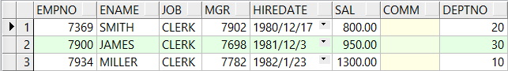

# Oracle

# 安装oracle

**csdn博客**

# Oracle的基本概念

## Oracle和mysql的区别


## 数据库

> Oracle数据库是数据的物理存储，这就包括（数据库文件ORA或者DBF、控制文件、联机日志、参数文件）。其实Oracle数据库的概念和其他的数据库不一样，这里的数据库是一个操作系统只有一个库。可以看作Orcle就只有一个大数据库。
>
> 是一个文件系统，是物理概念。

## 实例

> 一个Oracle实例(Oracle instance )有一系列的后台进程（Background Process)和内存结构（Memory strutures）组成。
>
> 一个数据库可以有n个实例，通常的话我们只使用一个实例

## 用户

> 用户是在实例下建立的。不同的实例可以建立相同的用户。
>
> 用户和表空间的关系：一个用户有一个默认的表空间，一个表空间可以为多个用户的默认表空间，用户和用户之间的数据是隔离的，数据是不会混淆。真正操作数据库的是用户。

## 表空间

> 表空间是Oracle对物理数据库上相关数据文件（ORA或者DBF文件）的逻辑映射。一个数据库在逻辑上被分成一到若干个表空间，每个表空间包含了在逻辑上相关联的一组结构。每个数据库至少有一个表空间（称之为system表空间）。
>
> 表空间是逻辑概念，一个表空间对映着一个或者多个的物理的存储文件（.ora//.dbf）

## Oracle的数据源

>driver: orcle.jdbc.OracleDriver
>
>url: jdbc:oracle:thin:@localhost:1521:orcl
>
>username: lgq
>
>password: lgq

oracle中用户的概念相当于mysql中的database，切换数据库的话相当于切换用户。


# Oracle的基本命令

## 1、登录

```bash
sqlplus sys/sys as sysdba #管理员用户，管理员登陆的时候我们要添加as sysdba
```

```bash
#使用数据库提供的默认账号登录
sqlplus scott/tiger
#会让我们修改密码，默认修改为tiger
```

## 2、基本命令

```bash
#查看用户
show user
#切换用户
conn sys/sys as sysdba
#如果终端显示的混乱，可以修改
#set linesize 300 ; 每行展示300个字符
#Col [列名] format a[数字] ,某一列占几个字符
#查看当前用户下的表
select * from tab;
#查看数据
select * from tablename
#查看表结构
desc tablename
```

```bash
#管理员sys的权限非常大，在管理员账户下，如果正常查询
select * from dept
#这是查询不到scott下的表的，但是由于管理员的权限很大，我们可以这样做查询
select * from scott.dept
```

### 1、Oracle的简单查询

#### 1、安装图形化界面PLSQL

```bash
http://www.xue51.com/soft/20943.html
```

#### 2、单位


#### 3、创建c##scott用户

```bash
#原文链接
https://blog.csdn.net/cfchengfei002/article/details/45582259?utm_medium=distribute.pc_feed_404.none-task-blog-BlogCommendFromMachineLearnPai2-3.nonecase&depth_1-utm_source=distribute.pc_feed_404.none-task-blog-BlogCommendFromMachineLearnPai2-3.nonecas
#链接数据库
sqlplus sys/sys as sysdba
#创建c##scott用户
CREATE USER c##scott IDENTIFIED BY tiger ;
#用户授权
GRANT CONNECT ,RESOURCE,UNLIMITED TABLESPACE TO  c##scott CONTAINER= ALL ;
#设置用户的表空间
ALTER USER c##scott DEFAULT TABLESPACE USERS;
ALTER USER c##scott TEMPORARY TABLESPACE TEMP ;
#使用c##scott用户登录
CONNECT c##scott/tiger
#删除数据表
DROP TABLE emp  PURGE ;
DROP TABLE dept PURGE ;
DROP TABLE bonus PURGE ;
DROP TABLE salgrade PURGE ;
#创建表
CREATE TABLE dept (deptno NUMBER(2) CONSTRAINT PK_DEPT PRIMARY KEY ,dname VARCHAR2(14) ,loc VARCHAR2(13) ) ;
CREATE TABLE emp (empno NUMBER(4) CONSTRAINT PK_EMP PRIMARY KEY ,ename VARCHAR2(10),job VARCHAR2(9),mgr NUMBER(4),hiredate DATE ,sal NUMBER(7,2),comm NUMBER(7,2),deptno NUMBER(2) CONSTRAINT FK_DEPTNO REFERENCES DEPT );
CREATE TABLE bonus (enamE VARCHAR2(10) ,job VARCHAR2(9)  ,sal NUMBER,comm NUMBER );
CREATE TABLE salgrade (grade NUMBER,losal NUMBER,hisal NUMBER );
```

```bash
#插入数据 dept
INSERT INTO dept VALUES (10, 'ACCOUNTING' , 'NEW YORK' );
INSERT INTO dept VALUES (20, 'RESEARCH' , 'DALLAS' );
INSERT INTO dept VALUES (30, 'SALES' , 'CHICAGO' );
INSERT INTO dept VALUES (40, 'OPERATIONS' , 'BOSTON' );
#插入数据 emp
INSERT INTO emp VALUES (7369, 'SMITH' , 'CLERK' ,7902,to_date( '17-12-1980' , 'dd-mm-yyyy' ),800, NULL ,20);
INSERT INTO emp VALUES (7499, 'ALLEN' , 'SALESMAN' ,7698,to_date( '20-2-1981' , 'dd-mm-yyyy' ),1600,300,30);
INSERT INTO emp VALUES (7521, 'WARD' , 'SALESMAN' ,7698,to_date( '22-2-1981' , 'dd-mm-yyyy' ),1250,500,30);
INSERT INTO emp VALUES (7566, 'JONES' , 'MANAGER' ,7839,to_date( '2-4-1981' , 'dd-mm-yyyy' ),2975, NULL ,20);
INSERT INTO emp VALUES (7654, 'MARTIN' , 'SALESMAN' ,7698,to_date( '28-9-1981' , 'dd-mm-yyyy' ),1250,1400,30);
INSERT INTO emp VALUES (7698, 'BLAKE' , 'MANAGER' ,7839,to_date( '1-5-1981' , 'dd-mm-yyyy' ),2850, NULL ,30);
INSERT INTO emp VALUES (7782, 'CLARK' , 'MANAGER' ,7839,to_date( '9-6-1981' , 'dd-mm-yyyy' ),2450, NULL ,10);
INSERT INTO emp VALUES (7788, 'SCOTT' , 'ANALYST' ,7566,to_date( '19-04-1987' , 'dd-mm-yyyy' )-85,3000, NULL ,20);
INSERT INTO emp VALUES (7839, 'KING' , 'PRESIDENT' , NULL ,to_date( '17-11-1981' , 'dd-mm-yyyy' ),5000, NULL ,10);
INSERT INTO emp VALUES (7844, 'TURNER' , 'SALESMAN' ,7698,to_date( '8-9-1981' , 'dd-mm-yyyy' ),1500,0,30);
INSERT INTO emp VALUES (7876, 'ADAMS' , 'CLERK' ,7788,to_date( '23-05-1987' , 'dd-mm-yyyy' )-51,1100, NULL ,20);
INSERT INTO emp VALUES (7900, 'JAMES' , 'CLERK' ,7698,to_date ( '3-12-1981' , 'dd-mm-yyyy' ),950, NULL ,30);
INSERT INTO emp VALUES (7902, 'FORD' , 'ANALYST' ,7566,to_date( '3-12-1981' , 'dd-mm-yyyy' ),3000, NULL ,20);
INSERT INTO emp VALUES (7934, 'MILLER' , 'CLERK' ,7782,to_date( '23-1-1982' , 'dd-mm-yyyy' ),1300, NULL ,10);
#插入测试数据 salgrade
INSERT INTO salgrade VALUES (1,700,1200);
INSERT INTO salgrade VALUES (2,1201,1400);
INSERT INTO salgrade VALUES (3,1401,2000);
INSERT INTO salgrade VALUES (4,2001,3000);
INSERT INTO salgrade VALUES (5,3001,9999);
```

```bash
#事务提交
COMMIT ;
```

## 3、使用PLSQL链接

安装好oracle数据库之后，使用plsql去链接数据库出现问题
**PLSQL连接Oracle：ORA-12154: TNS: 无法解析指定的连接标识符**
经过查询资料解决

```bash
链接：https://blog.csdn.net/qq_37725650/article/details/79843459
```

使用资料中的第一种方法就出现错误的时候，无法解析主机名，


解决无法解析名称

```bash
链接：https://blog.csdn.net/jiong_long/article/details/47666951
```

## 4、基本查询语句

```bash
#查询表格所有数据
select * from emp;
#别名查询，直接写别名，不用加分号
select empno as 员工编号 from emp;
#只要有编号的成员就可以查询的到
select * from emp where empno in (7369,7499,7521);
#% 模糊查询，_指定字符串的长度
select * from emp where ename like '_M%' #查询所有员工中名字第二个字母为M的员工
```

```bash
#oracle排序 注意：排序一般放在后面
#select * 列名 from 表名 {where 查询条件} order by 列名1 asc|desc 
#查询员工工资从高到底
select * from emp order by sal       #默认是正序排名，从高到底，asc是可以省略的
select * from emp order by sal desc #倒序
#可以多个列一起排序
select * from emp order by sal desc,hiredate desc #按照工资和入职日期倒序排列。
```

### 1、单行函数

```bash
#单行函数
#upper('smith')小写字母变大写
select upper('smith') from dual
#lower('SMITH')大写变小写
select lower('SMITH') from dual
#initcap('smith')首字母大写
select initcap('smith') from dual
#字符串连接
select 'hello' || 'world' from dual
#截取字符串
select subsrt('hello',1,3) from dual ;#我们的索引是从1开始的，所以结果为'hel' ,1改为0之后效果也是一样的
#获取字符串长度
select length('hello') from dual;
#替换函数
select replace('hello','l','x') from dual; #hello是被替换的元素，l是要替换元素中的字母，x是替换的元素，查询结果为'hexxo'
#四舍五入取值函数
select round(12.45) from dual: #结果为12
select round(12.454，2) from dual: #结果为12.45,四舍五入取两位小数
#去除位数
select trunc(12.87) from dual; # 12
select trunc(12.8763,2) from dual; # 12.87，就算是6也会去除，不会四舍五入
#取余函数
select mod(10,3) from dual; # 结果为1
#日期函数

```

# #################2020.12.17################

> 日期函数
>
> oracle中提供了许多和日期相关的函数，包括日期的加减，在日期的加减中有一些规律。
>
> 日期 - 数字 = 日期
>
> 日期 + 数字 = 日期
>
> 日期 - 日期 = 数字（天）

> 范例：查询雇员进入公司的周数，
>
> ​	分析：查询雇员进入公司的天数（sysdate - 入职日期） /  7

```bash
#查询当前系统的时间
select sysdate from dual;
#查询周数
select trunc((sysdate - hiredate) / 7) from emp; 
#查询员工入职的月数
select ename,trunc(months_between(sysdate,hiredate)) from emp;
#查看指定月数之后的日期，后面跟着的数字如果是负数的话就是前几个月
select add_months(sysdate,3) from dual;
#求下一个星期一是什么时候
select next_day(sysdate,'星期一') from dual;
#求出本月最后一天是什么时候
select last_day(sysdate) from dual;
```

### 2、转换函数

> 查询所有的雇员将年月日分开，此时可以使用TO_CHAT函数来拆分
>
> 拆分的时候需要使用通配符
>
> 年：y ， 年是四位数 yyyy
>
> 月：m ， 月是两位数mm
>
> 日： d ， 日是两位是dd
>
> 时：HH 12进制， HH24 24进制
>
> 分：mi
>
> 秒：ss

```bash
#通配符的使用
select ename,
       to_char(hiredate,'yyyy') 年,
       to_char(hiredate,'mm') 月,
       to_char(hiredate,'dd') 日
       from emp;
select to_char(sysdate,'yyyy-mm-dd HH24:mi:ss') from dual;
#查出来日期前面比如5月份是显示05的，这是前导0，我们可以去除
select to_char(sysdate,'fmyyyy-mm-dd HH24:mi:ss') from dual;
#查询工资可以把它分隔成 11,230 的格式
select to_char(sal,'99,999') from emp;
```

```bash
#把字符串转换成日期
select to_date('1select to_date('1982-04-23 14:23:42','yyyy-mm-dd HH24:mi:ss') from dual;982-04-23','yyyy-mm-dd') from dual;
```


### 3、通用函数

```bash
#空值处理函数，我们的奖金有的是为空，如果直接查询的话会显示为空，空值和任何值相加都是为空
select ename,sal*12 + comm from emp;
```


```bash
#使用nvl函数，解决有空值的问题，如果nvl(comm,0)中comm为空，就用0来代替
select ename,sal*12 + nvl(comm,0) from emp;
```


```bash
#decode函数，类似于if ...else if... esle....函数
#我们查询到的job都是英文的，我们要把它替换成中文
select ename,
	  decode(job,'CLERK','业务员',
                        'SALESMAN','销售',
                        'MANAGER','管理',
                        'ANALYST','分析员',
                        'PRESIDENT','总裁',
                        '无业') 
     from emp;
```


```bash
#case when
select ename,
       (case
         when job = 'CLERK' then
          '业务员'
         when job = 'SALESMAN' then
          '销售'
         when job = 'MANAGER' then
          '管理'
         when job = 'ANALYST' then
          '分析员'
         when job = 'PRESIDENT' then
          '总裁'
         else
          '无业'
       end) cjob
  from emp;
```


## 5、oracle多表查询

### 1、多表查询基本查询

> 如果使用select  * from emp,dept;的话，我们查询出来的数据是有56条的，emp 14 * dept 4 = 56 ，这样子是笛卡尔积，对我们查询没有任何帮助

```bash
#起别名方便查询
select * from emp e,dept d  where d.deptno = e.deptno
#查询雇员的编号，姓名，部门编号和名称
 select empno, ename, d.deptno, dname
    from emp e, dept d
   where e.deptno = d.deptno;
```


```bash
#查询出每个员工的上级领导
#分析： MGR是上级领导编号
select e.empno, e.ename, e1.empno, e1.ename
    from emp e, emp e1
```


```bash
#在上面基础下查询员工的上级领导和部门名称
select e.empno, e.ename, e1.empno, e1.ename, d.dname
     from emp e, emp e1, dept d
    where e.mgr = e1.empno
      and e.deptno = d.deptno
```


```bash
#查出每个员工编号，名字，部门名称，工资等级和上级领导姓名，工资等级
select e.empno,
       e.ename,
       e.sal,
       d.dname,
       s.grade 员工工资等级,
       e1.ename 员工领导姓名,
       decode(s1.grade,
              1,
              '一级',
              2,
              '二级',
              3,
              '三级',
              4,
              '四级',
              5,
              '五级',
              '无级') 领导工资等级
  from emp e, dept d, salgrade s, emp e1, salgrade s1
 where e.deptno = d.deptno
   and e.sal between s.losal and s.hisal
   and e.mgr = e1.empno
   and e1.sal between s1.losal and s1.hisal
```


### 2、外连接（左右链接）

```bash
#查询出每一个部门的员工
#两张表格做链接查询时，其中一种表要查询全量的数据（不会因为另外一张表的数据关联而被筛选掉），在两张表关联的时候，非全量表的关联字段后面加上(+)（未生效）
select * from emp e ,dept d where e.deptno(+) = d.deptno;
```

```bash
#左连接：在做外连接的时候全量表在左端就是左连接
select * from dept d,emp e  where d.deptno =  e.deptno(+) ;
#右连接：在做外连接的时候全量表在左端就是右连接（dept）
select * from emp e ,dept d where e.deptno(+) = d.deptno;
```

```bash
#查询员工编号和姓名和他上级领导的编号和姓名（解决空了一行的问题）
select e.empno, e.ename, e1.empno, e1.ename
    from emp e, emp e1
    where e.mgr = e1.empno(+)
```

### 3、sql1999对SQL的支持

#### 1、交叉连接

```BASH
select * from emp e cross join dept d;
```

#### 2、自然连接

```bash
select * from emp e natural join dept d;
```

#### 3、using子句

```bash
select * from emp join dept using(deptno) ;
```

#### 4、on子句，自己编写连接条件（重要）

```bash
select * from emp e join dept d on e.deptno = d.deptno;
#左连接，这个时候是用dept做全量表（要全部展示的表，比如dept的40号部门是在emp没有映射的，但是40号部门还是要显示出来）
#哪个表使用左连接，哪个表就是全量表，而且全量表放在左边
#dept做全量表，而且要放在左边
#使用左连接，全量表放左边
select * from dept d left join emp e on e.deptno = d.deptno;
#右连接，右连接哪个表，哪个表就是全量表，全量表放在右边
#dept做全量表，而且要放在右边
#使用右连接，全量表放右边
select * from emp e right join dept d on e.deptno = d.deptno;
```


## 6、函数使用

### 1、分组函数

```bash
#count() 计数
select count(empno) empnum from emp;#不建议使用* ，浪费性能
#min() 最小
select min(sal) minsal from emp;
#max() 最大
select max(sal) maxsal from emp;
#avg() 平均数 
select avg(sal) acgsal from emp;
#sum() 求和
select sum(sal) sumsal from emp;
```

### 2、分组统计

> 语法：select * 列名 from 表名 where 字段条件 {group by 字段1,group by 字段2,...} order by ......

```bash
#按照部门分组，每个部门的分一组
select count(empno),deptno from emp e group by deptno;
```


```bash
#每个部门的平均工资
select avg(sal) avgsal,deptno from emp group by deptno;
```


```bash
#查询出部门和部门的编号
select count(deptno),deptno from emp group by deptno;
```


```bash
#按照部门编号和部门名称分组查询出各部门人数
#要查询的部门编号和部门名称都应该进行分组
select count(d.deptno), d.deptno, d.dname
  from emp e, dept d
 where e.deptno = d.deptno
 group by d.deptno, d.dname;
```


```bash
#部门里面相同工作的人
select count(*), deptno, job from emp group by deptno, job order by deptno;
```


### 3、分组统计条件限定查询

> 在分组统计的时候如除了分组函数外，结果列必须要group by里面有的lie才能够实现。（group by后面有的前面才能有）

```bash
#HAVING 在group by后面作用在分组函数身上，（部门人数大于5）
select count(d.deptno), d.deptno, d.dname
  from emp e, dept d
 where e.deptno = d.deptno
 group by d.deptno, d.dname
having count(d.deptno) > 5;
```


```bash
#查出部门平局工资大于两千的部门
select avg(e.sal), d.dname
  from dept d, emp e
 where d.deptno = e.deptno
 group by d.dname
having avg(e.sal) > 2000;
```


```bash
#不是销售人员，从事同一工作的总工资，总工资大于5000，结果按月工资总和升序排序
select sum(sal), e.job
  from emp e
 where e.job <> 'SALESMAN'
 group by e.job
having sum(sal) > 5000
 order by sum(sal);
```


### 4、oracle子查询

> 子查询：在查询的内部还有查询，sql的任何位置都可以插入子查询，子查询必须在()中书写
>
> 1、单列子查询
>
> 2、当行子查询
>
> 3、多行子查询

```bash
#工资高于编号为7654的员工所有信息
select *
  from emp e1
 where e1.sal > (select e.sal from emp e where e.empno = 7654);
```


```bash
#查出比雇员7654的工资高，同时从事和7788工作一样的员工
select *
  from emp e3
 where e3.sal > (select e.sal from emp e where e.empno = 7654)
   and e3.job = (select e2.job from emp e2 where e2.empno = 7788);
```


```bash
#查询每个部门的最低工资和最低工资的雇员和部门名称
select e.*, p.dname
  from emp e,
       dept p,
       (select min(e.sal) minsal, e.deptno
          from emp e, dept d
         group by e.deptno) a
 where e.sal = a.minsal
   and e.deptno = a.deptno
   and e.deptno = p.deptno
```


```bash
#每个部门工资最低的员工，使用in，让所需要的数据击中子查询的内容，但是这个没有把部门进行关联
select *
  from emp t
 where t.sal in (select min(e.sal) from emp e group by e.deptno);
```



### 5、oracle的exists使用avi

```bash
#查询出有员工的部门有哪些
#使用distinct去重，in关键字尽量少使用，因为性能比较低，可以使用exists代替，exists的性能高。
select * from dept d where d.deptno in (select distinct deptno from emp);
```

```bash
#exists(faslse/true) 返回结果集为真，后面跟着的一定是子查询
#exists的查询一般是要和外层查询关联的
#如果在emp表格里面能查询到的e.deptno也能在dept里面查到，那么就为真
select * from dept d where exists(select * from emp e where e.deptno = d.deptno)
#哪个部门没人
select * from dept d where not exists(select * from emp e where e.deptno = d.deptno)
```

### 6、Oracle并集union和uniom all

```bash
#union：两个集合并集的使用，自动去除重复的数据，合并的列数必须要一致。
select * from emp e where e.sal > 1000
union
select * from emp e1 where e1.sal > 2000
#union all ：两个并集一起，但是不去重
select * from emp e where e.sal > 1000
union all
select * from emp e1 where e1.sal > 2000
```

## 7、oracle的增删改

### 和mysql一样

## 8、oracle的数据库事务

增删改的操作都要开启事务，事务必须提交，我们的数据才会在数据库中真正的变更。

```bash
#提交事务
commit
#回滚，只要事务还没有提交的话，我们就可以使用事务回滚
rollback;
```

```bash
#执行update语句的时候，没有提交事务之前事务是挂起状态的，这时这条数据是被锁住的。其他客户端是没有办法对这条数据进行修改的。d
```

```bash
#使用update锁住select查询，此时会锁住这条数据，别的操作(select * from emp for update)会失败
select * from emp for update;
```

## 9、oracle的表管理

### 1、建表

### 2、添加列

```bash
alter table myemp add(address varchar2(50));
#修改列
alter table myemp modify(address varchar2(10));
```

### 3、主键

```bash
#key
create table person(
	gender number(1) primary key
)
#或者
create table person(
	gender number(1) primary key,
	constraint person_id_key primary key(id)
)
```


### 4、唯一约束

```bash
#unique：表明这个列的值是唯一的，不能重复
create table person(
	gender number(1) unique
)
```

### 5、检查约束

```bash
#check
create table person(
	gender number(1) check gender in(0,1)
)
```


```bash
#可同时添加多个key
create table person(
   id number(4),
	gender number(1)
  constraint person_gender_check check (gender in (0,1)),
  constraint person_id_key primary key(id)
);
```

### 6、外键约束

> constraint detail_order_id_fk foreign key(order_id) references orders(order_id)

```bash
#建立表格，并且建立外键
drop table orders;
create table orders(
       order_id number(4),
       totalPrice number(7,2),
       order_time date,
       constraint orders_order_id_pk primary key(order_id)
);
drop table order_detail;
create table order_detail(
       detail_id number(4),
       price number(7,2),
       quantity number(4),
       order_id number(4),
       constraint detail_detail_id_pk primary key(detail_id),
       constraint detail_order_id_fk foreign key(order_id) references orders(order_id) 
       #声明orders中的order_id是order_detail中的外键，和order_detail中的order_id绑定。
);
#这个时候如果往order_detail中插入一个值，但是这个order_id是orders表格中没有的就会报错
```


```bash
#插入时有外键约束，删除的时候也有外键约束，主表删除的时候会有外键约束
delete from orders where order_id = 1000;
```


```bash
#强制删除
drop table orders cascade constraint
#级联删除
#给外键加上 on delete cascade的话，那么主表删除数据的时候也会一并连加外键的表格数据一并删除
constraint detail_order_id_fk foreign key(order_id) references orders(order_id) on delete cascade
```

### 7、Oracle的rownum和分页

```bash
#rownum的使用
select rownum, e.* from emp e;
```


```bash
#rownum是不支持大于号的，怎么实现分页
#第一步：查询全量的数据
select * from emp;
#第二部：以第一步的结果集作为一张表，限定条件rownum小于结束行号，结果列要把rownum作为结果集
select rownum rw, a.*
  from (select * from emp) a
 where rownum < 6 ;
#第三步：以第二步的结果集作为一张表，限定条件是第二步的rownum列大于开始行号，结果列是*
select *
    from (select rownum rw, a.* from (select * from emp) a where rownum < 11) a
   where a.rw > 5 ;
```

### 8、Oracle的视图

> 试图就是封装了一条复杂查询的语句

```bash
#创建视图要先给c##scott添加权限，切换到sys用户
grant connect, resource, dba to c##scott;
```


```bash
#创建视图
create view view_d20 as select * from emp t where t.deptno = 20;
#查询视图，应用：如果有复杂的查询时候，使用复杂查询是很消耗性能的，我们可以提前设置好视图，那么查询的话只需要查询视图就可以了，查询视图的代价就是select * from table_name;
select * from view_d20;
```

```bash
#创建视图或者覆盖，当我们修改了表格的数据之后，我们是会一同修改视图的。
create or replace view view_d20 as select * from emp t where t.deptno = 20;
```

```bash
#修改视图
update view_d20 t set t.ename = '史密斯' where t.empno = 7369;
#修改视图的时候是连同表格的数据也一并修改的。
```


```bash
#创建只读的视图
create or replace view view_d20 as select * from myemp t where t.deptno = 20 with read only;
```


### 9、Oracle的序列（表格自增）

```bash
#建立序列序列，序列并没有绑定到表格上，哪一张表格都可以使用
create sequence person_sequence;
#查询序列当前的值
select person_sequence.currval from dual;
#查询序列下一个值，会自增
select person_sequence.nextval from dual;
```


```bash 
#使用序列
insert into person values(person_sequence.nextval,1);
```

### 10、索引

> 索引是用于加速数据存储对象的数据对象。合理的使用索引可以大大降低 i / o 次数，从而提高数据的访问性能。

#### 1、单例索引

```bash
#创建单例索引，
create index person_index on person(gender);
#索引是不需要主动使用的，根据索引列查询的时候，就自动使用了索引。比如下面的查询自动使用了索引。
select * from person t where t.gender = 1;
```


#### 2、复合索引

```bash
#创建复合索引
create index ps_index on person(id,gender);
#插叙的时候会自动使用索引
select * from person t where t.id = 18 and t.gender = 1 ;
#注意：复合索引查询是有顺序的。下面的查询就不会使用索引
select * from person t where t.gender = 1 and t.id = 18;
```

索引的使用原则:

1、在大表上面建立索引才有意义（数据量大）

2、在where子句后面或者是连接条件上建立索引

3、索引的层次不要超过4层

## 10、Oracle高级PLSQL介绍

### 介绍

> PL/SQL(Procedure Language/SQL )
>
> PLSQL是Oracle对sql语言的过程化扩展，指在SQL命令语言中增加了过程处理语言（如分支、循环等），是SQL语言具有过程存储的能力。把SQL语言的数据操纵能力与过程语言的数据处理能力结合起来，使得PLSQL在面向过程但比过程语言简单、高效、灵活和实用。

### 1、pl/sql语法

#### 1、程序语法

```bash 
declare
	说明部分（变量说明，游标申明，例外说明）
begin
	语句序列（DML语句）
exception
	例外处理语句
End;
```

```bash
begin
#dbms_output.put_line()是输出语句
 dbms_output.put_line('hello world');
end;
```


#### 2、常量和变量定义

> 程序声明阶段可以用来定义常量和变量
>
> - 常量的基本类型就是oracle中的建表时候的变量如：char,varchar2,date,number,boolean,long
>
>   定义语法:	varl char(15);
>
>   ​					pasl number(19,2);
>
>   说明变量名、数据类型和长度后分别用分号结束来说明语句。
>
>   常量定义：married bollean:=true
>
> - 引用变量
>
>   Myname emp.ename%type
>
>   引用型变量，即my_name的类型与emp表中的ename的类型是一样的
>
>   在sql中使用into来赋值

```bash
#基本的常量
declare 
 pname varchar2(20); #定义变量
 page  number(4) := 20;  #定义常量
begin
  pname := 'zhangsan';
  dbms_output.put_line(pname);
  dbms_output.put_line(page);
end;
```


```bash
#引用类型
declare 
  pname myemp.ename%type; #这里把pname的类型声明和myemp中的ename类型一样
begin
  select m.ename into pname from myemp m where m.empno = 7369; #把查询出来的ename的值赋给pname
  dbms_output.put_line(pname);
end;
```


```bash
#记录型变量，类似于java中对象的使用，把emprec定义为和emp具有一样类型。
Emprec emp%rowtype
#记录分量的引用
emp_rec.ename = 'ADAMS';
#示例
declare 
  prec myemp%rowtype;
begin
  select * into prec from myemp m where m.empno = 7369; 
  dbms_output.put_line(prec.ename || '： 工资为： ' || prec.sal);
end;
```


#### 3、if分支

> 语法1：
>
> ​	IF	条件 THEN 语句1;
>
> ​	语句2;
>
> ​	End IF;
>
> 语法2:
>
> ​	IF　条件　THEN 语句序列1;
>
> ​	ELSE 语句序列2;
>
> ​	END IF;
>
> 语法3：
>
> ​	IF 条件 THEN 语句;
>
> ​	ELSEIF 条件 THEN 语句;
>
> ​	ELSE 语句;
>
> ​	END IF;

```bash
#if分支
declare
  pno number(4) := &num; #自定义输入,这样是可以从弹窗输入值的
begin
  if pno < 5 then
    dbms_output.put_line('输入小于5');
  else
    dbms_output.put_line('输入大于5');
  end if;
end;
```


```bash
#注意不是elseif，而是 elsif
declare
  pno number(4) := &num;
begin
  if pno < 5 then
    dbms_output.put_line('输入小于5');
  elsif pno < 10 then
    dbms_output.put_line('输入小于10');
  else
    dbms_output.put_line('大于10');
  end if;
end;
```

#### 4、LOOP循环

> 语法1：
> 		WHILE  total <= 2300 LOOP	
> 		...
> 		total := total + salary;
> 		END LOOP;
>
> 语法2：
> 		Loop
> 		EXIT[when 条件];
> 		....
>
> 语法3：
> 		FOR I IN 1..3 LOOP
> 		语句序列;
> 		END LOOP;

```bash
#while循环 不常用
declare
  total number(4) := 0;
begin
  while total <= 100 loop
    total := total + 1;
    dbms_output.put_line(total);
  end loop;
end;
#loop循环 最经常用
declare
  total number(4) := 0;
begin
  loop
    exit when total = 100;
    total := total + 1;
    dbms_output.put_line(total);
  end loop;
  dbms_output.put_line('退出了loop');
end;
```


```bash
#for循环 不常用
declare
  total number(4) := 0;
begin
  for total in 1 .. 100 loop
    dbms_output.put_line(total);
  end loop;
end;
```

# ################2020.12.18################

#### 5、*游标

> 在编写java程序中有集合的概念，那么在pl/sql中也会用到多条的记录，游标可以存储查询返回多条数据。
>
> 语法：
> 	CURSOR 游标名 [(参数名  数据类型 ，参数名  数据类型,......)]  IS SELECT 语句;
> 例子： cursor c1 is select ename from emp;
>
> 用法：
>
> - 打开游标		open c1;
> - 取一行游标的值    fetch c1 into pjob;
> - 关闭游标    close1;
> - 游标的结束方式： exit when c1%notfound;
> - 注意：pjob的类型要和emp表格中job类型一致

```bash
#cursor:使用游标的方式输出emp表中的员工编号和姓名,相当于把emp的数据一行一行的从表格取出，然后一行一行的存入到cursor中。
declare
  prec emp%rowtype; --定义记录行的变量
  cursor c1 is
    select * from emp; --定义游标
begin
  dbms_output.put_line('empno' || '   ' || 'ename');
  open c1;
  loop
    fetch c1
      into prec;
    exit when c1%notfound;
    dbms_output.put_line(prec.empno || '   ' || prec.ename);
  end loop;
  close c1;
end;
```

```bash
#按员工的工种涨工资，总裁1000元，经理800元，其他人员400元
declare
  prec myemp%rowtype;
  cursor c1 is
    select * from myemp;
  addsal number(4);
begin
  --1.打开游标 
  open c1;
  --2.开始循环
  loop
    --3.取值
    fetch c1
      into prec;
    --4.判断游标退出条件
    exit when c1%notfound;
    --5.判断身份职位
    if prec.job = 'PRESIDENT' then
      addsal := 1000;
    elsif prec.job = 'MANAGER' then
      addsal := 800;
    else
      addsal := 400;
      --结束if
    end if;
    update myemp t set t.sal = t.sal + addsal where t.empno = prec.empno;
    dbms_output.put_line(prec.job || ' ' || prec.sal);
    --6.结束循环
  end loop;
  --7.关闭游标
  close c1;
  --8.做增删改都需要提交事务
  commit;
end;
```

```bash
#为部门编号为10的员工增加工资，使用带有参数的游标
declare
  --游标定义为查询部门标号，相当于游标查询出来的数值只会是编号为10 的部门
  cursor c1(dno myemp.deptno%type) is
    select * from myemp m where m.deptno = dno;
  prec myemp%rowtype;
begin
  --除了这个地方，其他的地方的游标是不需要带参数的。
  open c1(10);
  loop
    fetch c1
      into prec;
    exit when c1%notfound;
    update myemp t set t.sal = t.sal + 1000 where t.empno = prec.empno;
  end loop;
  close c1;
  commit;
end;
```

#### 6、例外

> 例外是程序设计语言锁提供的一种功能，用来增强程序的健壮性和容错性。
> 系统定义的例外：
> 	not_data_found (没有找到数据)
> 	too_many_rows (select ... into 语句匹配多个行)
> 	zero_divide (被零除)
> 	value_error （算术或转换错误）
> 	timeout_on_resource (在等待资源的时候发生超时)

```sql
declare
  pnum number;
begin
  pnum := 1 / 0;
--捕获异常
exception
  when zero_divide then
    dbms_output.put_line('被 0 除');
  when value_error then
    dbms_output.put_line('数值转换错误');
  when others then
    dbms_output.put_line('其他异常');
end;
```

```sql
--自定义异常
--查询部门编号是50的员工
--查询部门编号是50的员工
declare
  prec emp%rowtype;
  cursor c1(dno myemp.deptno%type) is
    select * from myemp m where m.deptno = dno;
  not_data exception; --定义异常
begin
  open c1(50);
  loop
    fetch c1
      into prec;
    if c1%notfound then
      raise not_data; --这里抛出异常，会自动退出cursor（游标）
    end if;
  end loop;
  close c1;
exception
  when not_data then
    --捕捉异常
    dbms_output.put_line('自定义异常生效，没有员工');
  when others then
    dbms_output.put_line('其他异常');
end;
```


## 11、存储过程

> 存储过程（Stored Procedure）是在大型数据库系统中，一组为了完成特定功能的SQL语句集，经编译后存储在数据库中，用户通过指定存储过程的名字并且给出参数（如果该存储过程带有参数）来执行它。存储过程时数据库中一个重要的对象，任何一个设计良好的数据库应用程序都应该用到存储过程。
>
> 语法：
> 	create [or replace] PROCEDURE 过程名 [(参数名in/out 数据类型)]
> 	AS
> 	BEGIN
> 			PLSQL子程序体;
> 	END;
>
> 或者
>
> ​	create [or replace] PROCEDURE 过程名 [(参数名in/out 数据类型)]
> AS
> ​	BEGIN
> ​			PLSQL子程序体;
> ​	END 过程名;

```sql
--存储过程创建
create or replace procedure helloworld as
begin
  dbms_output.put_line('hello world');
end;
--使用存储过程
begin
  helloworld;
end;
```


```sql
  --给指定员工涨工资，如果我们在定义存储过程中，存储中的参数名和表格的数据名是一样的，那么就会出现数据混淆。
create or replace procedure addsal(pno    myemp.empno%type,
                                   salnum myemp.sal%type) as
  --定义变量
  prec myemp%rowtype;
begin
  select * into prec from myemp m where m.empno = pno;
  update myemp t set t.sal = t.sal + salnum where t.empno = pno;
  dbms_output.put_line(pno || '前 ：' || prec.sal || ' 后：' ||
                       (prec.sal + salnum));
end;
--使用
begin
  addsal(7369,300);
end;
--我们使用存储过程中，我们的提交要放在外面做，不要放在存储过程里面。
```

```sql
--计算指定员工的年薪
create or replace procedure countYSal(pno myemp.empno%type) as
  psal  myemp.sal%type;
  pcomm myemp.comm%type;
begin
  --多个值的赋值，是按照先后顺序来赋值的
  select t.sal, t.comm into psal, pcomm from emp t where t.empno = pno;
  dbms_output.put_line('年薪  ' ||  (psal * 12 + nvl(pcomm, 0)));
end;
  
begin
  countysal(7369);
end;
```

### 通过plsql调用存储过程

```sql
 --创建存储过程
  --计算指定员工的年薪
  create or replace procedure countYSal1(pno  in myemp.empno%type,
                                         ysal out number) as
  psal  myemp.sal%type;
  pcomm myemp.comm%type;
begin
  --多个值的赋值，是按照先后顺序来赋值的
  select t.sal, t.comm into psal, pcomm from myemp t where t.empno = pno;
  ysal := (psal * 12 + nvl(pcomm, 0)); --因为奖金可能为空，所以我们使用nvl来解决
  dbms_output.put_line('年薪  ' || ysal);
end;
 --调用存储过程
declare
  pno number := &num; --自定义输入
  ysal number; --定义一个对象来存储输出的值
begin
  countYsal1(pno, ysal);
  dbms_output.put_line(ysal);
end;
```

$$

$$

## 12、存储函数

> 存储函数：
> 	create or replace function 函数名(Name in type ,Name in type,....)  return 数据类型 is 结果变量 数据类型;
> begin
> 	return(结果变量);
> end 函数名;

```sql
--使用存储函数穿指定员工的年薪
--存储函数
create or replace function countysalf(pno in myemp.empno%type)
  return number is
  Result number;
  psal   myemp.sal%type;
  pcomm  myemp.comm%type;
begin
  select m.sal, m.comm into psal, pcomm from myemp where m.pno = pno;
  Result = psal * 12 + nvl(pcomm, 0);
  return(Result);
end countysalf;
```

> 存储过程和存储函数的区别
> 	一般来说，过程和存储的区别在于函数只可以返回一个值，而过程没有返回值。但是过程可以通过out指定一个或者多个输出参数。我们可以利用out参数，在过程中实现返回多个值。建议使用存储过程。

# Java程序来调用存储过程和存储函数

pom文件

```xml
<dependency>
            <groupId>com.oracle.ojdbc</groupId>
            <artifactId>ojdbc8</artifactId>
            <version>19.3.0.0</version>
        </dependency>
        <dependency>
            <groupId>com.oracle.ojdbc</groupId>
            <artifactId>orai18n</artifactId>
            <version>19.3.0.0</version>
        </dependency>

        <dependency>
            <groupId>javax.xml.bind</groupId>
            <artifactId>jaxb-api</artifactId>
            <version>2.3.0</version>
        </dependency>

        <dependency>
            <groupId>com.sun.xml.bind</groupId>
            <artifactId>jaxb-impl</artifactId>
            <version>2.3.0</version>
        </dependency>

        <dependency>
            <groupId>com.sun.xml.bind</groupId>
            <artifactId>jaxb-core</artifactId>
            <version>2.3.0</version>
        </dependency>

        <dependency>
            <groupId>javax.activation</groupId>
            <artifactId>activation</artifactId>
            <version>1.1.1</version>
        </dependency>
```


```java
//jdbc连接方法
package com.atlgq.oracle;

import oracle.jdbc.OracleType;
import oracle.jdbc.OracleTypes;

import java.sql.*;

public class Main {
    public static void main(String[] args) {
        ResultSet rs = null;
        PreparedStatement stmt = null;
        Connection conn = null;
        CallableStatement cs = null;
        try {
            //加载驱动和地址，及地址连接
            Class.forName("oracle.jdbc.driver.OracleDriver");
            String dbURL = "jdbc:oracle:thin:@localhost:1521:orcl";
            conn = DriverManager.getConnection(dbURL, "c##scott", "tiger");
            System.out.println("数据库连接成功！");
            //连接数据库成功
            //获取CallableStatement对象
            cs = conn.prepareCall("{call countysal1(?,?)}");
            cs.setInt(1,7369);
            //注册Oracle的输出参数类型
            cs.registerOutParameter(2, OracleTypes.NUMBER);
            //执行存储过程
            cs.execute();
            //获得返回值
            int ysal = cs.getInt(2);
            System.out.println(ysal);

        } catch (ClassNotFoundException e) {
            e.printStackTrace();
        } catch (SQLException e) {
            e.printStackTrace();
            System.out.println("数据库连接失败！");
        } finally {
            try {
                if (rs != null) {
                    rs.close();
                    rs = null;
                }
                if (stmt != null) {
                    stmt.close();
                    stmt = null;
                }
                if (conn != null) {
                    conn.close();
                    conn = null;
                }
            } catch (SQLException e) {
                e.printStackTrace();
            }
        }
    }
}

```

# 触发器

> 数据库触发器是一个与表相关联的、存储的PL/SQL程序。每当一个特定的数据操作语句(Insert,update,delete)在指定的表上发出时，Oracle自动地执行触发器中定义的语句序列。
>
> 触发器可用于：
> 	数据确认
> 	实施复杂的安全性检查
> 	做审计，跟踪表上所作的数据操作等
> 	数据的备份和同步
>
> 触发器类型：
> 	语句级触发器：在指定的操作语句操作之前或之后执行一次，不管这条语句影响了多少行
> 	行级触发器（FOR EACH ROW）：触发语句作用的每一条记录都被触发。在行级触发器中使用old和new伪记录变量，识别值的状态。
>
> 语法：
> 	CREATE [OR REPLACE] TRIGGER 触发器名
> 	{before | after}
> 	{delete | insert | update [of 列名]}
> 	on 表名
> 	[FOR EACH ROW [WHEN(条件)]]
> begin
> 	PLSQL 块
> END 触发器命

## 语句级触发器

```sql
--创建插入person表格的触发器
create or replace trigger insertptrg
  before insert on person
begin
  dbms_output.put_line('insert done');
end insertptrg;
```

```sql
--在休息时间不能插入数据
create or replace trigger valid_insert_p
  before insert on person
declare
  cruday varchar2(10); --定义字符串的时候要给长度的
begin
  select to_char(sysdate, 'day') into cruday from dual;
  if cruday = '星期六' or cruday='星期日' then
    raise_application_error(-20001, '休息日不允许插入数据');
  end if;
end valid_insert_p;
```

```sql
insert into person values(seqpersonid.nextval,'王五',0,(sysdate - 2000));
```

## 行级触发器

```sql
--判断员工工资涨之后要比涨之前高
create or replace trigger vaild_addsal
  before update of sal on myemp
  for each row
begin
  if :new.sal <= :old.sal then
    raise_application_error(-20002, '错误');
  end if;
end vaild_addsal;
--如果工资涨之后低，会报错
```


# Oracle建模

## 单表建模

### 1、选择要建立的模型

### 

### 2、选择创建表格


### 3、推荐命名规则


### 4、给用户ID添加序列


## 多表建模,一对多,多对一

### 1、再建立一张order表格，有序列


### 2、建立关系

一个用户是要有多个订单表的，所以订单表属于用户，一个用户多张订单，一对多


> 一对多，从用户表分析
>
> - 箭头指向的表格时1，箭头发起的表格时多(除了一对一)，多的一段有一个外键，有一个来自1的外键，在两张表对应的java实体类中，1的一端应该有多的一段的实体类集合。
>
> 多对一，从订单表分析
>
> - 在两张表对应的java实体类中多的一端有一的一端的java实体类的属性.

## 一对一


> 在这里我们把用户ID作为身份证表格的外键,同时把它设置为主键,那么就实现了一对一的关系.
>
> 一对一:
>
> - 箭头发起和指向的表格都是一,特点是箭头所指向的表的主键在箭头发起的表格中,即做主键也做外键,在java实体类中各有对方实体类的属性.

多对多


> 只需要新建一张表,然后这张表格包含各自表格的主键,中间的表格叫做联合主键,不可以有其他的业务字段


> 分析:用户1,可以有角色1,角色2,用户2,可以有角色1,角色2

# Oracle数据库模型和表的转化

> database -> generate database
>
> 在SQL语句中
>
> ```sql
> --@sql文件路径
> @E:\WorkPlaceTotal\Powerdesigner\Sql\test.sql
> ```
>
> 

# Oracle数据库的文件导出


```sql
???prompt PL/SQL Developer Export Tables for user C##SCOTT@ORCL
prompt Created by Administrator on 2020年12月18日
set feedback off
set define off

prompt Dropping R_USER...
drop table R_USER cascade constraints;
prompt Creating R_USER...
create table R_USER
(
  user_id  NUMBER(8) not null,
  username VARCHAR2(10) not null,
  password VARCHAR2(10) not null,
  date     DATE,
  address  VARCHAR2(50),
  gender   NUMBER(1)
)
;
comment on column R_USER.gender
  is '1.男，2.女';
alter table R_USER
  add constraint PK_R_USER primary key (USER_ID);

prompt Loading R_USER...
prompt Table is empty

set feedback on
set define on
prompt Done

```

# Oracle的用户导入导出

## 导出

> 只有导出结构，没有数据


## 导入

> @文件路径