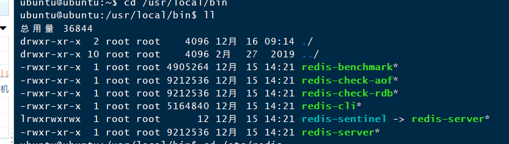

## NoSql数据模型


Nosql特点：

1、方便扩展（数据之间没有关系，很好扩展）

2、大数据高性能（Redis一秒可以写八万次，读11万次，Nosql的缓存记录级，是一种细粒度的缓存，性能会比较高）

3、数据类型是多样的！（不需要实现去设计数据库，随取随用，如果数据量十分大的表，很多人是无法设计的）

4、传统的RDBMS和NoSQL

```
传统的RDBMS

-结构化组织

-SQL

-数据和关系都在存在于单独的表中

-数据操作，数据定义语言

-严格一致性

-基础的事务
```


```
Nosql

-不仅仅是数据

-没有固定的查询语言

-键值对存储，列存储，文档存储，图书数据库（社交关系）

-最终一致性

-CAP定理和BASE

-高性能，高可用，高可扩
```


## Nosql四大分类

1、键值对

2、列存储数据库

3、文档型数据库

4、图形数据库

## CAP

## BASE

## Redis入门

### 概述：

Redis是什么

Redis（Remote Dictionary Server )，即远程字典服务

Redis能干什么

1、内存存储、持久化，内存中是断电即失、所以说持久化很重要（rdb、aof）

2、效率高，可以用来高速缓存

3、发布订阅系统

4、地图信息分析

5、计时器、计数器（浏览量）

6、、、、、、

Redis特性：

1、多样的数据类型

2、持久化

3、集群

4、事务

.....
学习中需要用到的东西

1、Redis官网


# 安装

Redis推荐在Linux上安装运行

## 1、windows安装

略

## 2、linux安装

1、下载安装包，传到linux上，解压

2、截图


3、基本的命令安装

```bash
yum install gcc-c++
```

确定配置好gcc的环境，然后使用make

```bash
make
```

```bash
sudo make install
```


4、安装的目录

我们安装好的文件在 /usr/local/bin



5、复制一份redis.conf文件（/home/ubuntu/usr/local/redis）

```bash
cp redis.conf redis.conf.bk
```

6、redis默认不是后台启动

修改为后台默认启动


修改为后台启动

7、启动redis

```bash
redis-server /配置文件的位置
redis-server /home/ubuntu/usr/local/redis/redis.conf
```


8、验证

```bash
redis-cli -h localhost -p 6379
```


9、关闭

```bash
shutdown
exit
```

## 性能测试

1、redis-benchmark 自带的测试工具

```bash
redis-benchmark -h localhost -p 6379 -c 100 -n 10000
```


## redis的基础知识

### 1、默认有16个数据库


默认使用的是第0个

可以用select去切换数据库

```bash
127.0.0.1:6379> select 3 
```


```bash
keys * //查看所有的key
flushdb //清除当前数据库
flushall //清除全部的数据库
```

Redis是单线程

明白单线程是很快的，官方表示，Redis是基于内存操作，cpu不是redis的性能瓶颈，redis的瓶颈是根据机器的内存和网络带宽，既然可以使用单线程，就使用单线程

Redis是C语言写的，官方提供数据为100000+ QPS，完全不比MemeCache差

Redis为什么这么快

1、误区：高性能的服务一定是多线程？

2、误区：多线程比多线程效率高？

核心：redis是将所有的数据放在内存中的，所以说使用单线程去操作效率是最高的，多线程（CPU切换上下文是一个耗时的操作），对于内存系统来说，没有上下问切换效率是最高的。多次读写都是在一个cpu上的，在内存情况下，这个就是最佳方案

## 关于Redis的基本命令

## 五大基本数据类型

### Redis-key

```bash
127.0.0.1:6379> set name lgq //设置值
OK
127.0.0.1:6379> set age 23
OK
127.0.0.1:6379> exists name		//判断是否有值，有值的话返回一
(integer) 1
127.0.0.1:6379> exists name1	//不存在这个值，返回0
(integer) 0
127.0.0.1:6379> move name 1		//移除这个key
(integer) 1
127.0.0.1:6379> get name		
(nil)
127.0.0.1:6379> expire name 10  //设置值得过期时间，单位是秒
(integer) 1
127.0.0.1:6379> ttl name	//查看过期时间还有多久
(integer) 7
127.0.0.1:6379> type name  //查看当前key的类型
string

```


### string

```bash
127.0.0.1:6379> set key1 v1
OK
127.0.0.1:6379> append key1 hello //追加字符串，如果存在就追加，不存在的话就新建
(integer) 7
127.0.0.1:6379> get key1
"v1hello"
127.0.0.1:6379> strlen key1 //获取字符串的长度
(integer) 7
127.0.0.1:6379> append key1 hello,world
(integer) 18
127.0.0.1:6379> get key1
"v1hellohello,world"
127.0.0.1:6379> strlen key1
(integer) 18
127.0.0.1:6379> 
##################################################################################################################
127.0.0.1:6379> get views
"0"
127.0.0.1:6379> incr views  //相当于i++
(integer) 1
127.0.0.1:6379> incr views
(integer) 2
127.0.0.1:6379> incr views
(integer) 3
127.0.0.1:6379> decr views //相当于i--
(integer) 2
127.0.0.1:6379> decr views
(integer) 1 
127.0.0.1:6379> incrby views 10 //10个增加
(integer) 11
127.0.0.1:6379> incrby views 10
(integer) 21
127.0.0.1:6379> decrby views 5	//5个减少
(integer) 16
127.0.0.1:6379> decrby views 5
(integer) 11
#################################################################################################################
字符串范围：
127.0.0.1:6379> getrange key1 0 4  //获取0-4
"v1hel"
127.0.0.1:6379> getrange key1 0 -1 //获取全部字符串
"v1hellohello,world"

#替换
127.0.0.1:6379> setrange key1 0 abcde //从第0个位置开始，替换为abcde
(integer) 18
127.0.0.1:6379> get key1
"abcdeeohello,world"
################################################################################################################
127.0.0.1:6379> setex key3 30 key3 //设置key3，指定30秒过期
OK
127.0.0.1:6379> setnx mykey mykey  //设置mykey，如果存在则失败，这边原本不存在mykey，所以显示成功
(integer) 1
127.0.0.1:6379> setnx mykey hello  //这边已经存在mykey了，所以失败返回0，在分布式锁中会经常使用
(integer) 0
#################################################################################################################
127.0.0.1:6379> mset k1 v1 k2 v2 k3 v3 //同时设置多个值
OK
127.0.0.1:6379> mget k1 k2 k3 //同时获取
1) "v1"
2) "v2"
3) "v3"
127.0.0.1:6379> msetnx k1 v1 k4 v4 //原子性操作，要么一起成功，要么一起失败
(integer) 0
127.0.0.1:6379> get k4
(nil)
#对象
127.0.0.1:6379> mset user:1:name lgq user:1:age 23 //
OK
127.0.0.1:6379> mget user:1:name user:1:age //
1) "lgq"
2) "23"

127.0.0.1:6379> getset key4 redis //先获取在设置
(nil)
127.0.0.1:6379> get key4
"redis"
127.0.0.1:6379> getset key4 mongoDB //获取到前面的值，然后再设置
"redis"
127.0.0.1:6379> get key4
"mongoDB"


```


### list

在redis里面，list可以当做：栈，队列，阻塞队列

所有的list命令都是l开头的

```bash
127.0.0.1:6379> lpush list 1  //插入到list中
(integer) 1
127.0.0.1:6379> lpush list 2
(integer) 2
127.0.0.1:6379> lpush list 3
(integer) 3
127.0.0.1:6379> lrange list 0 -1 //获取list的全部数据
1) "3"
2) "2"
3) "1"
127.0.0.1:6379> lrange list 0 1  //获取0-1的数据
1) "3"
2) "2"
127.0.0.1:6379> rpush list right  //插入到队列的最后面位置
(integer) 4
127.0.0.1:6379> lrange list 0 -1
1) "3"
2) "2"
3) "1"
4) "right"

```

# ##########2020.12.14###########

```bash
127.0.0.1:6379> lpop list //左边移除一个元素，第一个元素
"3"
127.0.0.1:6379> rpop list //右边移除一个元素，最后一个元素
"right"
127.0.0.1:6379> lrange list 0 -1
1) "2"
2) "1"
#######################################################
lindex  //根据下表取出元素
127.0.0.1:6379> lindex list 0 
"2"
127.0.0.1:6379> lindex list 1
"1"
127.0.0.1:6379> llen list //获取list的长度
(integer) 2
#######################################################
lrem //移除指定的值
127.0.0.1:6379> lrange list 0 -1
1) "6"
2) "6"
3) "6"
4) "6"
5) "5"
6) "4"
7) "3"
8) "2"
9) "1"
127.0.0.1:6379> lrem list 2 6 //指定列表，然后指定数量和元素
(integer) 2
127.0.0.1:6379> lrange list 0 -1
1) "6"
2) "6"
3) "5"
4) "4"
5) "3"
6) "2"
7) "1"
#######################################################
ltrim 截取指定范围内的东西
1) "6"
2) "5"
3) "4"
4) "3"
5) "2"
6) "1"
127.0.0.1:6379> ltrim list 1 3 //截取（保留）list里面1-3的元素
OK
127.0.0.1:6379> lrange list 0 -1
1) "5"
2) "4"
3) "3"
#######################################################
rpoplpush:移除列表最后一个元素，并且移动到新的列表中
127.0.0.1:6379> lrange list 0 -1
1) "5"
2) "4"
3) "3"
127.0.0.1:6379> rpoplpush list newList
"3"
127.0.0.1:6379> lrange list 0 -1 #查看原来的列表
1) "5"
2) "4"
127.0.0.1:6379> lrange newList 0 -1 #查看新列表
1) "3"
#######################################################
#######################################################
lset 将列表指定下标的值更新为一个新的值，如果这个列表不存在的话那么就会报错
127.0.0.1:6379> lset list 1 hello
OK
127.0.0.1:6379> lrange list 0 -1
1) "6"
2) "hello"
3) "6"
4) "6"
5) "6"
6) "5"
7) "4"
#######################################################
linsert #将某个值在指定的位置前/后插入
127.0.0.1:6379> linsert list before 5 world #在5前面插入一个world
(integer) 9
127.0.0.1:6379> lrange list 0 -1
1) "hello"
2) "6"
3) "hello"
4) "6"
5) "6"
6) "6"
7) "world"
8) "5"
9) "4"
127.0.0.1:6379> linsert list after 5 five #在5后面插入一个five
(integer) 10
127.0.0.1:6379> lrange list 0 -1
 1) "hello"
 2) "6"
 3) "hello"
 4) "6"
 5) "6"
 6) "6"
 7) "world"
 8) "5"
 9) "five"
10) "4"
```


小结：

- 它实际上是一个链表，before Node after，left，right都可以插入值

- 如果key不存在，创建新的列表

- 如果key存在，新增内容

- 如果移除了所有值，空链表，也代表不存在！

- 在两边插入或者改动值，效率最高，中间元素会相对来说低一点

  消息队列！消息队列Lpush Lpop ，栈Lpush Rpop


### set（集合）

set中的值是不可以重复的，

```bash
127.0.0.1:6379> sadd myset hello #集合添加值
(integer) 1
127.0.0.1:6379> sadd myset lgq
(integer) 1
127.0.0.1:6379> sadd myset world
(integer) 1
127.0.0.1:6379> smembers myset #查看所有的值
1) "lgq"
2) "hello"
3) "world"
127.0.0.1:6379> sismember myset hello #判断集合是否有元素
(integer) 1 
127.0.0.1:6379> sismember myset hello1 
(integer) 0
127.0.0.1:6379> scard myset #查看集合的长度
(integer) 3
##############################################################
127.0.0.1:6379> smembers myset 
1) "lgq"
2) "hello1"
3) "hello"
4) "world"
127.0.0.1:6379> srem myset hello #移除指定元素
(integer) 1
127.0.0.1:6379> smembers myset
1) "lgq"
2) "hello1"
3) "world"

##############################################################
#set 是无序不重复的，srandmember随机取出一个值
127.0.0.1:6379> srandmember myset 1
1) "hello1"
127.0.0.1:6379> srandmember myset 1
1) "world"
127.0.0.1:6379> srandmember myset 1
1) "lgq"
127.0.0.1:6379> srandmember myset 1
1) "lgq"
##############################################################
#spop：随机删除key
127.0.0.1:6379> spop myset
"6"
127.0.0.1:6379> spop myset
"world"
127.0.0.1:6379> spop myset
"1"
##############################################################
#将指定的key移动到另外一个set中
127.0.0.1:6379> smembers myset
1) "hello1"
2) "5"
3) "7"
4) "3"
5) "lgq"
6) "2"
7) "4"
127.0.0.1:6379> smembers newset #新的set要存在，不存在的话移动失败
1) "1"
127.0.0.1:6379> smove myset newset 3
(integer) 1
##############################################################
#微博、b站、共同关注
	- 交集 sinter
	- 并集 sunion
	- 差集 Sdiff
127.0.0.1:6379> sadd set1 1
(integer) 1
127.0.0.1:6379> sadd set1 2
(integer) 1
127.0.0.1:6379> sadd set1 3
(integer) 1
127.0.0.1:6379> sadd set1 4
(integer) 1
127.0.0.1:6379> smembers set1
1) "1"
2) "2"
3) "3"
4) "4"
127.0.0.1:6379> sadd set2 2
(integer) 1
127.0.0.1:6379> Sdiff set1 set2 #set1和set2对比，看set1和set2的差别
1) "1"
2) "3"
3) "4"
127.0.0.1:6379> sinter set1 set2 #查看set1和set2的交集，共同有的元素
1) "2"
127.0.0.1:6379> sunion set1 set2 #查看set1和set2的并集
1) "1"
2) "2"
3) "3"
4) "4"

```


### hash（map集合）

```bash
#Map集合：这时候这个集合是map集合！本质上和String类型没有太大的区别，还是一个简单的key-value
127.0.0.1:6379> hset myhash field1 hello #设置key-value
(integer) 1
127.0.0.1:6379> hset myhash field2 world
(integer) 1
127.0.0.1:6379> hget myhash field1 #通过key获取value
"hello"
127.0.0.1:6379> hget myhash field2
"world"
127.0.0.1:6379> hmset myhash field3 1 field4 2 #批量设置
OK
127.0.0.1:6379> hmget myhash field1 field3 #批量获取
1) "hello"
2) "1"
hset myhash field1 heollll #可以覆盖
(integer) 0
127.0.0.1:6379> hgetall myhash #获取全部数据
1) "field1"
2) "heollll"
3) "field2"
4) "world"
5) "field3"
6) "1"
7) "field4"
8) "2"
127.0.0.1:6379> hdel myhash field1 #删除指定的key
(integer) 1
127.0.0.1:6379> hgetall myhash 
1) "field2"
2) "world"
3) "field3"
4) "1"
5) "field4"
6) "2"
##############################################################
#hlen：获取长度
127.0.0.1:6379> hlen myhash
(integer) 3
##############################################################
#判断指定字段是否存在
127.0.0.1:6379> HEXISTS myhash field2
(integer) 1
127.0.0.1:6379> HEXISTS myhash field1
(integer) 0
##############################################################
#只获取所有的values
#只获取所有的keys
127.0.0.1:6379> hkeys myhash
1) "field2"
2) "field3"
3) "field4"
127.0.0.1:6379> hvals myhash
1) "world"
2) "1"
3) "2"
##############################################################
#自增和自减
127.0.0.1:6379> HINCRBY myhash field3 2 #自增2，如果为负数就为自减
(integer) 5
127.0.0.1:6379> hsetnx myhash field5 hhhh #添加，如果不存在添加
(integer) 1
127.0.0.1:6379> hsetnx myhash field5 hhhh #如果存在就添加失败
(integer) 0
```

hash变更的数据，user name age，尤其是用户信息之类的，经常变动的信息，hash更加

### zset(有序集合)

```bash
127.0.0.1:6379> zadd myset 1 one #添加一个
(integer) 1
127.0.0.1:6379> zadd myset 2 four 3 ten #添加多个
(integer) 2
127.0.0.1:6379> zrange myset 0 -1 
1) "one"
2) "four"
3) "ten"
##############################################################
#如何排序
127.0.0.1:6379> zadd salary 1000 zhangsan
(integer) 1
127.0.0.1:6379> zadd salary 1200 lisi
(integer) 1
127.0.0.1:6379> zadd salary 100 wangwu
(integer) 1
127.0.0.1:6379> zrangebyscore salary -inf +inf #-inf是负无穷 +inf是正无穷，从小到大 
1) "wangwu"
2) "zhangsan"
3) "lisi"
127.0.0.1:6379> zrevrange salary 0 -1 withscores #从大到小排序
1) "zhangsan"
2) "1000"
3) "wangwu"
4) "100"

127.0.0.1:6379> zrangebyscore salary -inf +inf withscores #把对应的数据也打印出来
1) "wangwu"
2) "100"
3) "zhangsan"
4) "1000"
5) "lisi"
6) "1200"
127.0.0.1:6379> zrangebyscore salary -inf 1000 withscores  #根据指定范围获取值
1) "wangwu"
2) "100"
3) "zhangsan"
4) "1000"
##############################################################
##############################################################
#移除指定有序集合元素
127.0.0.1:6379> zrem salary lisi
(integer) 1
127.0.0.1:6379> zrange salary 0 -1
1) "wangwu"
2) "zhangsan"
#获取有序集合的个数
127.0.0.1:6379> zcard salary
(integer) 2
##############################################################
#判断两个区间的个数
127.0.0.1:6379> zrange salary 0 -1 withscores
 1) "wangwu"
 2) "100"
 3) "zhangsa4"
......
19) "lisi5"
20) "2000"
127.0.0.1:6379> zcount salary 101 2001 #获取工资101到2001区间的人员个数
(integer) 4

```

案例思路：set排序， 存储班级的成绩表，工资表

普通消息：1、重要消息；2、带权重的判断

排行榜应用实现，取Top N


## 三种特殊数据类型

### geospatial（地理位置）

朋友的定位，附近的人，打车距离计算

Redis的Geo在Redis3.2版本就推出了

可以查询的一些测试数据

```bash
#geoadd  添加地理位置，（精度，维度，名称）
#规则：两级无法直接添加，我们一般下载城市数据，通过java程序直接导入
localhost:6379> geoadd china:city 116.40 39.90 beijing
(integer) 1
localhost:6379> geoadd china:city 121.47 31.23 shanghai
(integer) 1
localhost:6379> geoadd china:city 106.50 29.53 chongqi
(integer) 1
localhost:6379> geoadd china:city 114.05 22.52 shengzhen
(integer) 1
localhost:6379> geoadd china:city 120.16 30.24 hangzhou 108.96 34.26 xian
(integer) 2
####################################################################
#geopos 获取指定城市经度和纬度
localhost:6379> geopos china:city beijing
1) 1) "116.39999896287918091"
   2) "39.90000009167092543"
localhost:6379> geopos china:city chongqi
1) 1) "106.49999767541885376"
   2) "29.52999957900659211"
####################################################################
#geodist 获得两者之间的距离
localhost:6379> geodist chine:city beijing chongqi km
"1464.0708"
localhost:6379> geodist chine:city beijing shengzhen km
"1945.7881"
#查看我附近的人：（获得所有附近的人的位置，通过半径来查询）
####################################################################
#georadius ：以给定的经纬度为中心，查询附近的人
localhost:6379> georadius chine:city 110 30 1000 km  #以110 30 为中心，附近1000km内的
1) "chongqi"
2) "xian"
3) "shengzhen"
4) "hangzhou"
localhost:6379> georadius chine:city 110 30 500 km
1) "chongqi"
2) "xian"
localhost:6379> georadius chine:city 110 30 500 km withdist #....显示到中心的距离
1) 1) "chongqi"
   2) "341.9374"
2) 1) "xian"
   2) "483.8340"
localhost:6379> georadius chine:city 110 30 500 km withcoord #.....打印出别人经纬度
1) 1) "chongqi"
   2) 1) "106.49999767541885376"
      2) "29.52999957900659211"
2) 1) "xian"
   2) 1) "108.96000176668167114"
      2) "34.25999964418929977"
localhost:6379> georadius chine:city 110 30 500 km withcoord count 1 #显示1个
1) 1) "chongqi"
   2) 1) "106.49999767541885376"
      2) "29.52999957900659211"
localhost:6379> georadius chine:city 110 30 500 km withcoord count 2 #显示2个
1) 1) "chongqi"
   2) 1) "106.49999767541885376"
      2) "29.52999957900659211"
2) 1) "xian"
   2) 1) "108.96000176668167114"
      2) "34.25999964418929977"
localhost:6379> georadius chine:city 110 30 500 km withcoord count 3 #显示3个
1) 1) "chongqi"
   2) 1) "106.49999767541885376"
      2) "29.52999957900659211"
2) 1) "xian"
   2) 1) "108.96000176668167114"
      2) "34.25999964418929977"
# GEORADIUSBYMEMBER：根据指定城市寻找附近的城市
localhost:6379> GEORADIUSBYMEMBER chine:city shanghai 1000 km
1) "hangzhou"
2) "shanghai"
localhost:6379> GEORADIUSBYMEMBER chine:city shengzhen 1000 km
1) "shengzhen"
localhost:6379> 
#GEO 底层就是Zset，我们可以使用zset命令来操作geo
localhost:6379> zrange chine:city 0 -1
1) "chongqi"
2) "xian"
3) "shengzhen"
4) "hangzhou"
5) "shanghai"
6) "beijing"
localhost:6379> zrem chine:city xian
(integer) 1
localhost:6379> zrange chine:city 0 -1
1) "chongqi"
2) "shengzhen"
3) "hangzhou"
4) "shanghai"
5) "beijing"

```


### hyperloglog

```bash
#基数（不重复的元素） = 5，可以接受的误差
#Redis2.6.9版本就更新了Hyperloglog数据结构
#Redis Hyperloglog基数统计的算法
#优点：占用的内存是固定的。
#网页的UV（同一个人访问多次，但是只有一个人的数据）
#传统的做法：set（无序不重复的方法）
localhost:6379> PFadd mykey1 a b c d e f g h i j #增加数据
(integer) 1
localhost:6379> pfcount mykey1
(integer) 10
localhost:6379> PFadd mykey2 h i j k l o f s a d c e g a 
(integer) 1
localhost:6379> PFMERGE mykey3 mykey1 mykey2 #合并mykey1 mykey2到mykey3 
OK
localhost:6379> pfcount mykey3
(integer) 14
#如果允许容错，那么一定使用Hyperloglog，如果不允许容错，使用set 或者别的
```


### Bitmaps

```bash
#位储存：统计用户信息，活跃，不活跃，登录，未登录，只有两个状态的，都可以使用bitmaps
#使用bitmaps来记录周一到周日的打卡情况
```


```bash
#查看是否打卡
localhost:6379> getbit sign 6
(integer) 0
localhost:6379> getbit sign 1
(integer) 1
#统计打卡的天数，数值为1的天数
localhost:6379> bitcount sign
(integer) 4
```

## 事务

Redis事务的本质：一组命令的集合！一个事务的所有命令都会被序列化，在事务执行的过程中，会按照顺序执行。

一致性、顺序性、排他性！执行一些列的命令

Redis没有隔离界别的概念

所有的命令在事务中没有直接被执行，只有发行执行命令的时候才会执行，Redis单条命令的是具有原子性的，但是事务不保证有原子性

redis的事务：

- 开启事务（multi）

- 命令入队（...）

- 执行事务（exec）

  锁：redis可以实现乐观锁，watch

正常执行事务：

```bash
localhost:6379> multi #开启事务
OK
localhost:6379> set k1 v1 #命令入队
QUEUED
localhost:6379> set k2 v2
QUEUED
localhost:6379> get k1 
QUEUED
localhost:6379> get k2
QUEUED
localhost:6379> exec #执行事务
1) OK
2) OK
3) "v1"
4) "v2"

#放弃事务
discard  #如果放弃事务的话，那么事务里面的操作都不会被执行
```

```bash
#编译型异常(代码有问题，命令错误)事务中的所有命令都不会被执行
localhost:6379> set k1 v1
QUEUED
localhost:6379> set k2 v2
QUEUED
localhost:6379> getset k3
(error) ERR wrong number of arguments for 'getset' command
localhost:6379> set k4 v4
QUEUED
localhost:6379> exec
(error) EXECABORT Transaction discarded because of previous errors.

```


```bash
#运行时异常 如果存在语法型错误，那么执行命令的时候
localhost:6379> multi
OK
localhost:6379> set k1 v1
QUEUED 
localhost:6379> incr k1 #会执行的时候出错，编译的时候不会出错
QUEUED
localhost:6379> set k2 v2
QUEUED
localhost:6379> get k2
QUEUED
localhost:6379> exec
1) OK
2) (error) ERR value is not an integer or out of range  #虽然命令报错了，但是命令依旧执行成功了
3) OK
4) "v2"
```

悲观锁

- 很悲观，认为什么时候都会出现问题，无论做什么都需要加锁


乐观锁

- 很乐观，认为什么时候都不会出问题，所以不会上锁，更新数据的时候去判断一下，在此期间是否有人修改过这个数据。
- 获取version
- 更新的时候比较version

Redis的监控测试

正常执行成功

```bash
127.0.0.1:6379> watch money  #监视money
OK
127.0.0.1:6379> multi  #开启事务
OK
127.0.0.1:6379> decrby money 20
QUEUED
127.0.0.1:6379> incrby out 20
QUEUED
127.0.0.1:6379> exec #执行事务，事务正常结束
1) (integer) 80
2) (integer) 20
```

执行失败

```bash
127.0.0.1:6379> watch money #每次事务结束后会自动停止事务，所以我们这里还要在开启事务
OK
127.0.0.1:6379> multi 
OK
127.0.0.1:6379> decrby money 10
QUEUED
127.0.0.1:6379> incrby out 10
QUEUED
127.0.0.1:6379> exec
(nil)					#由于其他的线程对这个money进行了操作，所以我们的事务进行是失败的

#另外一个线程
127.0.0.1:6379> get money
"80"
127.0.0.1:6379> set money 1000
OK
127.0.0.1:6379> get money
"1000"

###################################################################################
127.0.0.1:6379> unwatch   #上一次的事务执行失败之后要解锁watch
OK
127.0.0.1:6379> watch money
OK
127.0.0.1:6379> multi
OK
127.0.0.1:6379> decrby money 30
QUEUED
127.0.0.1:6379> incrby out 30
QUEUED
127.0.0.1:6379> exec #执行事务的时候和上一次的值对比，如果有变化的话，那么就事务执行失败。再次解锁，再次监视
1) (integer) 970
2) (integer) 50
```


## Jedis

我们要用Java来操作redis

> 什么是jedis：是redis官方推荐的java链接开发工具。使用java操作redis中间件，如果你要用java操作redis，那么就要对jedis十分属性

> 测试

1、导入pom文件

```xml
 <!--引入jedis的依赖-->
        <!-- https://mvnrepository.com/artifact/redis.clients/jedis -->
        <dependency>
            <groupId>redis.clients</groupId>
            <artifactId>jedis</artifactId>
            <version>3.3.0</version>
        </dependency>

        <!---fastjson-->
        <dependency>
            <groupId>com.alibaba</groupId>
            <artifactId>fastjson</artifactId>
            <version>1.2.71</version>
        </dependency>
```

2、操作

连接linux的时候是需要把linux上redis配置文件中的保护模式给关闭的，否则是无法连接

```java
//1、链接redis，new 一个对象即可
        Jedis jedis = new Jedis("localhost",6379);
        //2、命令操作，和之前学的一样
        System.out.println(jedis.ping());
```

3、通过redis再次理解事务

```java
jedis.flushDB();

        //开启事务
        Transaction multi = jedis.multi();

        try {
            multi.set("user1",result);
            multi.set("user2",result);
            int a = 1 / 0;
            //执行事务
            multi.exec();
        }catch (Exception e){
            //若是出错,放弃事务
            multi.discard();
            e.printStackTrace();
        }finally {
            System.out.println(jedis.get("user1"));
            System.out.println(jedis.get("user2"));
            //关闭链接
            jedis.close();
        }
```

## redis和spring boot的整合

springboot操作数据：spring-data-jpa jdbc mongodb redis

springdata 也是和 springboot 齐名的

说明：在springboot2.x之后，jedis被替换成了lettuce

jedis:底层采用的是直连，多个线程操作的话，是不安全的

lettuce：采用nety，实例可以在多个线程中进行共享，不存在线程不安全的情况，可以减少线程的使用


### 1、pom文件

### 2、操作


```java
 //这是正常的命令
        redisTemplate.opsForValue().set("k1","v1");
        System.out.println(redisTemplate.opsForValue().get("k1"));

        //一些crud等命令可以直接执行
        redisTemplate.multi();
        //链接数据库进行操作
        RedisConnection connection = redisTemplate.getConnectionFactory().getConnection();
        connection.flushDb();
        connection.close();
```

### 3、自定义RedisTemplate

当我们要调用redis储存对象的时候,如果没有序列化的时候。


```java
 User user = new User(23, "林贵全");
        String jsonUser = new 		
        ObjectMapper().writeValueAsString(user);
		redisTemplate.opsForValue().set("user",jsonUser);
 System.out.println(redisTemplate.opsForValue().get("user"));

```

spingboot默认采用的序列化是jdk序列化，我们如果想采用自己的序列化的话

```java
@Configuration
public class MyConfig {

    //自定义自己的template,一般为了开发方便，是使用<String,Object>
    @Bean
    @ConditionalOnSingleCandidate(RedisConnectionFactory.class)
    public RedisTemplate<String, Object> redisTemplate(RedisConnectionFactory redisConnectionFactory) {
        RedisTemplate<String, Object> template = new RedisTemplate();
        
        //配置我们自己的序列化方式
        Jackson2JsonRedisSerializer<Object> objectJackson2JsonRedisSerializer = new Jackson2JsonRedisSerializer<Object>();
        //使用我们配置的序列化方式
        template.setKeySerializer(objectJackson2JsonRedisSerializer);
        
        template.setConnectionFactory(redisConnectionFactory);
        return template;
    }
}
```

在企业开发的时候我们可以自己封装一个utils

## Redis的config配置详解

启动的时候直接从config中配置开始

> 网络

```bash
bind 127.0.0.1 #绑定的ip地址
protected-mode yes #保护模式，默认是开启的
port 6379 #端口
```

> 通用

```bash
daemonize yes #以守护进程的方式运行，默认是no，需要自己开启yes
pidfile /var/run/redis/redis-server.pid #如果是守护进程开启的，那么就需要指定一个pid

#日志级别
# Specify the server verbosity level.
# This can be one of:
# debug (a lot of information, useful for development/testing)
# verbose (many rarely useful info, but not a mess like the debug level)
# notice (moderately verbose, what you want in production probably)
# warning (only very important / critical messages are logged)
loglevel notice
#日志的输出位置
logfile /var/log/redis/redis-server.log
#数据库的数量
database 16
#是否显示logo
always-show-logo yes

```

> 快照

```bash
持久化，在规定的时间里面，执行了多少次操作，则会持久化到文件中
redis是内存数据库，断电即失
#900内，如果至少有一个key进行修改，我们及时进行持久化操作
save 900 1 
save 300 10
save 60 10000
#持久化出错了，我们是否继续工作
stop-writes-on-bgsave-error yes
#是否压缩rdb持久化文件，需要消耗一些内存
rdbcompression yes
#保存rdb的时候，进行检查
rdbchecksum yes
#rdb文件保存位置
dir /var/lib/redis
```

> 安全

```bash
可以在在这里设置redis的的密码
#requirepass 123456
root@127:/home/ubuntu/usr/local# redis-cli
127.0.0.1:6379> ping
(error) NOAUTH Authentication required.
127.0.0.1:6379> auth 123456
OK
127.0.0.1:6379> ping
PONG

#maxclients 10000 最大的客户端连接数
#maxmemory <bytes> #redis配置最大的内存容量
#maxmemory-policy noeviction #内存到达上限之后的处理策略
	- 移除一些过期的key
	- 报错
	- 等等
```

> APPEND ONLY模式 aof配置

```bash
appendonly no #默认是不开启aof模式的，默认是使用rdb方式持久化的，在大部分情况，rdb完全够用！
appendfilename "appendonly.aof" #持久化文件的名字
appendfsync always #每次修改都执行一次sync，消耗性能
appendfsync everysec #每秒都执行一次sync，可能会丢失1s的数据
appendfsync no #不执行sync，这个时候系统会自己同步数据，速度最快。
```


## Redis持久化

RDB

我们默认的是RDB，是不需要修改的

在生产环境下，我们有时候会把rdb的文件进行备份

```bash
dbfilename dump.rdb #这是默认生成的rdb文件


修改redis.conf 里面的
save 60 5 #六十秒内做出五次修改就写入rdb文件
#测试之后，60秒内操作了五次之后生成了一个dump.rdb文件
```

> 触发规则：生成dump.rdb文件

```bash
1、save的规则满足之后会生成一个
2、执行flushAll的时候触发rdb规则
3、推出redis，也会触发rdb规则
```

>恢复rdb文件

```bash
1、只需要将rdb文件放在redis的启动目录下就可以了，redis启动的时候会自动去扫描dump.rbd，恢复数据
2、查看需要存放的位置
	/usr/local/bin #这是redis-server 的存放位置
```

> rbd几乎默认的配置就够用了


### 优点：

1、适合大规模的数据恢复

2、对数据的完整性不高

### 缺点：

1、需要一定的时间的间隔进行操作，如果redis意外宕机了，那么最后一次修改的数据就没了

2、fork进程的时候，会占用一定的内存空间

# ###########2020.12.16#############

AOF(Append Only File)

>是什么
>
>- 将我们所有的命令记录下来，以日志的形式去记录每个写操作，将Redis执行过的写操作记录下来，只需追加文件但是不许改写文件，redis启动之初会读取该文件重新构建数据，换言之，redis重启的话就根据日志文件将写指令从前到后执行一次以完成数据的恢复工作。

AOF保存到是

```bash
appendonly.aof
```


默认是不开启的，我们需要手动配置，把no改为yes就可以这个时候重启redis就可以了

如果这个时候aof的文件损坏了，redis是无法启动成功的，我们可以使用

> redis-check-aof --fix

修复这个文件，如果文件正常了，重启就可以恢复了

如果aof大于64m，fork一个新进程来把我们的进程重写，aof默认的是文件的无限追加

>优点：
>
>1、每一次修改都同步，文件的完整会更好
>
>2、每一秒都同步一次，可能会丢失一秒的数据
>
>3、从不同步，效率最高
>
>缺点：
>
>1、相对于数据文件来说，aof文件远远大于rdb，修复的速度也更慢
>
>2、aod运行的效率也比rdb也比较慢，所以默认的是rdb


## redis实现订阅发布

Redis发布订阅(pub/sub)是一种消息通信模式: 发送者(pub)发送消息，订阅者(sub)接收消息

Redis客户端可以订阅任意数量的频道

### 测试

1、订阅一个消息频道

```bash
SUBSCRIBE channel1
Reading messages... (press Ctrl-C to quit)
1) "subscribe"
2) "channel1"
3) (integer) 1

```

2、给指定一个频道发送消息

```bash
127.0.0.1:6379> PUBLISH channel1 "hello,world"
(integer) 1

```

3、订阅频道的接收到了消息

```bash
127.0.0.1:6379> SUBSCRIBE channel1
Reading messages... (press Ctrl-C to quit)
1) "subscribe"
2) "channel1"
3) (integer) 1
1) "message"  #消息
2) "channel1" #来自的频道
3) "hello,world" #接收到的消息

```


使用场景：

1、实时消息系统

2、实时聊天（频道当作聊天室，消息回显给所有人就可以）

3、订阅、关注系统就可以


## redis主从赋值

```
主从复制，是指将一台Redis服务器的数据，复制到其他的Redis服务器。前者称为主节点(master)，后者称为从节点(slave)；数据的复制是单向的，只能由主节点到从节点。默认情况下，每台Redis服务器都是主节点；且一个主节点可以有多个从节点(或没有从节点)，但一个从节点只能有一个主节点。
```

主从复制，读写分离，80%的情况下都是在进行读操作，减缓服务器的压力，架构中经常使用！一主二从，哨兵模式，选举法（一个redis集群起码三台服务器）

redis的最大使用内存不超过20G，如果超过了的话那么就更换集群。公司项目中，主从复制是必须要使用的。

默认情况下，每一个redis服务器都是主节点

### 环境配置

只配置从库，不用配置主库

```bash
ubuntu@ubuntu:~$ redis-cli
127.0.0.1:6379> auth 123456
OK
127.0.0.1:6379> info replication #查看当前库的信息
# Replication
role:master  #rerdis服务器默认自己是主节点
connected_slaves:0  #没有从机
master_replid:3a3aebebba84a1663e1288ab40a41f3eebb8aa06
master_replid2:0000000000000000000000000000000000000000
master_repl_offset:0
second_repl_offset:-1
repl_backlog_active:0
repl_backlog_size:1048576
repl_backlog_first_byte_offset:0
repl_backlog_histlen:0

```


#### 1、复制三份配置文件

```bash
cp redis.conf redis-79.conf
cp redis.conf redis-80.conf
cp redis.conf redis-81.conf
```

#### 2、修改

1、端口

2、pid文件名字

3、log文件名字

4、dump文件名字

#### 3、开启服务

```bash
redis-server /home/ubuntu/usr/local/redis/redis-79.conf
redis-server /home/ubuntu/usr/local/redis/redis-80.conf
redis-server /home/ubuntu/usr/local/redis/redis-81.conf
```

#### 4、查看进程


### 一主二从配置

默认情况下，每一台都是主节点：一般情况下只配置从机

一主（79），二从（80，81）

在从机中进行配置

```bash
127.0.0.1:6380> info replication
# Replication
role:slave #角色变成了slave
master_host:127.0.0.1 #主机地址
master_port:6379 #主机的端口
master_link_status:up
master_last_io_seconds_ago:1
master_sync_in_progress:0
slave_repl_offset:14
slave_priority:100
slave_read_only:1
connected_slaves:0
master_replid:99cc1ad512b3786186ac380ac946bb46552528eb
master_replid2:0000000000000000000000000000000000000000
master_repl_offset:14
second_repl_offset:-1
repl_backlog_active:1
repl_backlog_size:1048576
repl_backlog_first_byte_offset:1
repl_backlog_histlen:14

```

主机信息

```bash
127.0.0.1:6379> info replication
# Replication
role:master
connected_slaves:2 #子节点的个数
slave0:ip=127.0.0.1,port=6380,state=online,offset=56,lag=0 #子节点的信息
slave1:ip=127.0.0.1,port=6381,state=online,offset=56,lag=0
master_replid:99cc1ad512b3786186ac380ac946bb46552528eb
master_replid2:0000000000000000000000000000000000000000
master_repl_offset:56
second_repl_offset:-1
repl_backlog_active:1
repl_backlog_size:1048576
repl_backlog_first_byte_offset:1
repl_backlog_histlen:56

```

> 细节

1、主机能写，从机不能写，只能读。

```bash
#6379主机写
127.0.0.1:6379> set key1 hello,world
OK
#6380从机写
127.0.0.1:6380> set key1 hello
(error) READONLY You can't write against a read only replica.
#6380从机读
127.0.0.1:6380> get key1
"hello,world"
```

2、测试：

1、如果我们的主机宕机了，我们从机还是不会变，如果主机重新上线，依旧读写数据没有问题。

2、如果是使用命令行配置主从复制，那么从机重启后将恢复主机身份。只要变成从机，那么就可以立马从主机获取数据。我们的数据一定可以从从机中获取。


## redis哨兵模式

自动选举主机模式

Redis从2.8开始就提供sentinel（哨兵模式）。


哨兵作用：

- 通过发送命令，让redis服务器返回监控其运行状态，包括主服务器和从服务器。
- 当哨兵检测到master宕机的时候，会自动把slave变成master，然后通过发布订阅的模式通知其他的服务器，修改配置文件，让它们切换主机。

一般来说也会配置一个哨兵集群，所以配置一个redis集群一开始就有六个服务。


测试：

目前状态一主二从。

1、配置哨兵配置文件 sentinel-6379.conf(这是复制后的文件)

```bash
#sentinel monitor 哨兵名称 主机地址 端口 代表主机挂了，投票给谁
sentinel monitor mymaster 127.0.0.1 6379 1
```

2、启动哨兵

```bash
redis-sentinel /home/ubuntu/usr/local/redis/sentinel-6379.conf
```

启动后的哨兵监控到的信息

```bash
114250:X 16 Dec 2020 11:02:36.678 # WARNING: The TCP backlog setting of 511 cannot be enforced because /proc/sys/net/core/somaxconn is set to the lower value of 128.
114250:X 16 Dec 2020 11:02:36.683 # Sentinel ID is 373f19d6219ef05527668947c964ed3183e6ebe3
114250:X 16 Dec 2020 11:02:36.683 # +monitor master mymaster 127.0.0.1 6379 quorum 2  #这是监控的端口
#这是检测到的信息，检查到的两台从机。
114250:X 16 Dec 2020 11:02:36.684 * +slave slave 127.0.0.1:6380 127.0.0.1 6380 @ mymaster 127.0.0.1 6379
114250:X 16 Dec 2020 11:02:36.686 * +slave slave 127.0.0.1:6381 127.0.0.1 6381 @ mymaster 127.0.0.1 6379
```

这时候我们让6379宕机，过一会之后哨兵会自动选举一个master出来


如果宕机的主机恢复了，那么只能当新主机的从机。


优点：

1、哨兵集群一般基于主从复制模式，所有的主从配置优点，它全有

2、主从可以切换，故障可以转移，系统的可用性就会更好

3、哨兵模式就是主从模式的升级，手动到自动，更加健壮

缺点：

1、Redis不好在线扩容，集群容量到达上线，在线扩容就十分麻烦

2、实现烧饼模式的配置其实是很麻烦的，里面有很多的选择。


## 缓存穿透和雪崩（服务器高可用的问题）

### 缓存穿透（查询不到）

> 比如用户想查询一个数据，但是发现redis是没有的，那么就直接去查询持久层数据库。发现也没有，于是本次查询失败，缓存都没有命中。要是有很多用户都去查询这个数据，那么就会给持久层造成很大的压力，这就相当于出现了缓存穿透。

解决方案

> 布隆过滤器
>
> 布隆过滤器是一种数据结构，对所有可能查询的参数用hash形式存储，在控制层先进性校验，不符合规则就丢弃，从而避免了对底层存储系统的查询压力。
>
> 缓存空对象
>
> 当存储层不命中之后，即使返回空对象也将其存储起来，同时会设置一个过时时间，之后再访问这个数据会从缓存中获取，保护了持久层的数据
>
> 缺点：
>
> 1、如果空置也缓存，那么就会缓存很多个空值的键，浪费空间
>
> 2、即使对空值设置了过期时间，还是会存在缓存层和存储层的数据有一段时间窗口的不一致，这对于保持一致性的业务会有影响。

### 缓存击穿（查询太多，key瞬间过期）

> 这里需要注意的是和缓存穿透的区别，缓存击穿，是指一个key很热门，在不停的扛着大并发，大并发集中对一个点进行访问，当这个key在失效的瞬间，持续的大并发就会穿破缓存，直接请求数据库，就像在一个屏障上凿开了一个洞。
>
> 当某个key在过期的瞬间，有大量的请求并发访问，这类数据一般是热点数据，由于缓存过期，会同时访问数据库来查询最新的数据，并且写回缓存，会导致数据库瞬间的压力过大。

解决方案

> 1、设置热点的key永不过期，就不会存在缓存击穿的现象
>
> 2、加互斥锁
>
> - 分布式锁：使用分布式锁，保证对于每个key同时只有一个线程去查询后端服务，其他线程没有获得分布式锁的权限，因此只需要等待即可。这种方式将高并发的压力转移到了分布式锁，因此对分布式锁的考验很大

### 缓存雪崩

> 概念
>
> ​	在某一段时间内；某些缓存集中失效过期，redis集群宕机。
>
> 产生雪崩的原因之一：比如写文本的时候，马上就要双十二零点，很快就会迎来一波抢购，这波商品时间比较集中的放入缓存当中，假设缓存了一个小时，那么到了凌晨一点钟的时候，这批商品的缓存时间就都过期了，而对这批商品的访问查询都还没有结束，一下子落在了数据库上面，对于数据库而言，这就会产生周期性的压力波峰。于是所有的请求都会到达存储层，存储层的调用量会暴增，造成存储层也可能挂掉的情况。

### 解决方案

1、redis高可用

这个思想的含义是，既然redis有挂掉的可能，那么就多增加几台redis，这样一台redis挂掉之后还可以继续工作，其实就是多集群服务（异地多活）

2、限流降级

在缓存失效之后，通过加锁或者队列的来控制数据库的写缓存线程数量，比如对某一个key只允许一个线程查询数据和写缓存，其他线程等待。

3、数据预热

数据预热的含义就是在正式部署之前，我们先把可能的数据先访问一边，这样大部分可能访问到的数据就会加载在缓存中，在即将发生大量并发前手动触发加载缓存不同的key，设置不同的过期时间，让缓存失效的时间尽量均匀


## 小结：

