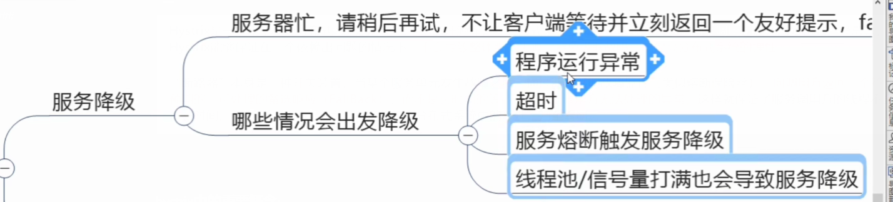
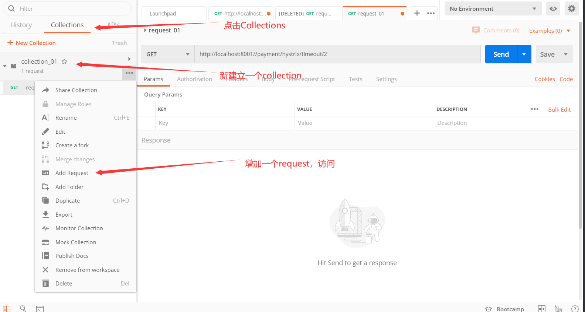
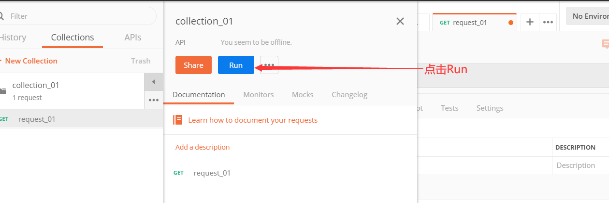
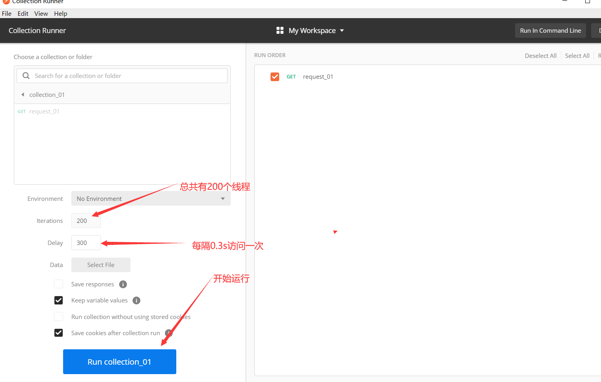

######################基础分割线#####################

# 4,服务降级:


## 12,Hystrix服务降级


### hystrix中的重要概念:

#### 1,服务降级



**比如当某个服务繁忙,不能让客户端的请求一直等待,应该立刻返回给客户端一个备选方案**

> FallBack


#### 2,服务熔断

**当某个服务出现问题,卡死了,不能让用户一直等待,需要关闭所有对此服务的访问然后调用服务降级**


#### 3,服务限流

**限流,比如秒杀场景,不能访问用户瞬间都访问服务器,限制一次只可以有多少请求**


## 使用hystrix,服务降级:

##### 1,创建带降级机制的pay模块 :

名字: 

```java
cloud-provider-hystrix-payment8001
```

##### 2,pom文件

```xml
<dependencies>
    
       <!-- hystrix-->
        <dependency>
            <groupId>org.springframework.cloud</groupId>
            <artifactId>spring-cloud-starter-netflix-hystrix</artifactId>
        </dependency>
    
	    <!-- 引用自己定义的api通用包，可以使用Payment支付Entity -->
        <dependency>
            <groupId>com.atlgq.springcloud</groupId>
            <artifactId>cloud-api-commons</artifactId>
            <version>${project.version}</version>
        </dependency>
        <dependency>
            <groupId>org.springframework.boot</groupId>
            <artifactId>spring-boot-starter-web</artifactId>
        </dependency>
        <!--监控-->
        <dependency>
            <groupId>org.springframework.boot</groupId>
            <artifactId>spring-boot-starter-actuator</artifactId>
        </dependency>
     
        <!--eureka client-->
        <dependency>
            <groupId>org.springframework.cloud</groupId>
            <artifactId>spring-cloud-starter-netflix-eureka-client</artifactId>
        </dependency>
        <!--热部署-->
        <dependency>
            <groupId>org.springframework.boot</groupId>
            <artifactId>spring-boot-devtools</artifactId>
            <scope>runtime</scope>
            <optional>true</optional>
        </dependency>
        <dependency>
            <groupId>org.projectlombok</groupId>
            <artifactId>lombok</artifactId>
            <optional>true</optional>
        </dependency>
        <dependency>
            <groupId>org.springframework.boot</groupId>
            <artifactId>spring-boot-starter-test</artifactId>
            <scope>test</scope>
        </dependency>
    </dependencies>
```


##### 3,配置文件

```yml
server:
  port: 8001

spring:
  application:
    name: cloud-provider-hystrix-payment

eureka:
  client:
    register-with-eureka: true
    fetch-registry: true
    service-url:
      defaultZone: http://eureka7001.com:7001/eureka,http://eureka7002.com:7002/eureka

```


##### 4,主启动类

```java
@SpringBootApplication
@EnableEurekaClient
public class PaymentHystrixMain8001 {
    public static void main(String[] args) {
        SpringApplication.run(PaymentHystrixMain8001.class,args);
    }
}
```

##### 5,service

创建接口和实现类

```java
package com.atlgq.springcloud.service;

import org.springframework.stereotype.Service;

import java.util.concurrent.TimeUnit;

@Service
public class PaymentServiceImpl implements PaymentService {
    @Override
    public String payment_ok(Integer id) {

        return "线程池： " + Thread.currentThread().getName() + "  payment_ok,id: " + id;
    }

    @Override
    public String payment_timeout(Integer id) {
        int timeoutNumber = 3;
        try {
            TimeUnit.SECONDS.sleep(timeoutNumber);
        } catch (InterruptedException e) {
            e.printStackTrace();
        }
        return "线程池： " + Thread.currentThread().getName() + "  payment_timeout,id: " + id;
    }
}

```

##### 6、controller

```java
import com.atlgq.springcloud.service.PaymentService;
import lombok.extern.slf4j.Slf4j;
import org.springframework.web.bind.annotation.GetMapping;
import org.springframework.web.bind.annotation.PathVariable;
import org.springframework.web.bind.annotation.RestController;

import javax.annotation.Resource;

@RestController
@Slf4j
public class PaymentController {

    @Resource
    private PaymentService paymentService;

    @GetMapping(value = "/payment/hystrix/ok/{id}")
    public String payment_ok(@PathVariable("id") Integer id){
        return  paymentService.payment_ok(id);
    }

    @GetMapping(value = "/payment/hystrix/timeout/{id}")
    public String payment_timeout(@PathVariable("id") Integer id){
        return  paymentService.payment_timeout(id);
    }
}

```


##### 7,先测试:以上为跟基平台，从正确->错误->降级熔断->恢复

```java
http://localhost:8001/payment/hystrix/ok/2
http://localhost:8001//payment/hystrix/timeout/2
```

​	

使用postman







> 此时使用压测工具,并发20000个请求,请求会延迟的那个方法,
> 		压测中,发现,另外一个方法并没有被压测,但是我们访问它时,却需要等待
> 		这就是因为被压测的方法它占用了服务器大部分资源,导致其他请求也变慢了，tomcat的默认工作线程被打满了，没有多余的线程可以分解压力和处理

##### 8,先不加入hystrix,


#### 2,创建带降级的order模块:

##### 1,名字:  

```java
cloud-consumer-feign-hystrix-order80
```

##### 2,pom

```xml
<dependencies>
        <!-- openfeign -->
        <dependency>
            <groupId>org.springframework.cloud</groupId>
            <artifactId>spring-cloud-starter-openfeign</artifactId>
        </dependency>
        <!--hystrix-->
        <dependency>
            <groupId>org.springframework.cloud</groupId>
            <artifactId>spring-cloud-starter-netflix-hystrix</artifactId>
        </dependency>
        <!--eureka client-->
        <dependency>
            <groupId>org.springframework.cloud</groupId>
            <artifactId>spring-cloud-starter-netflix-eureka-client</artifactId>
        </dependency>


        <!-- 引用自己定义的api通用包，可以使用Payment支付Entity -->
        <dependency>
            <groupId>com.atlgq.springcloud</groupId>
            <artifactId>cloud-api-commons</artifactId>
            <version>${project.version}</version>
        </dependency>
        <dependency>
            <groupId>org.springframework.boot</groupId>
            <artifactId>spring-boot-starter-web</artifactId>
        </dependency>
        <!--监控-->
        <dependency>
            <groupId>org.springframework.boot</groupId>
            <artifactId>spring-boot-starter-actuator</artifactId>
        </dependency>
        <!--热部署-->
        <dependency>
            <groupId>org.springframework.boot</groupId>
            <artifactId>spring-boot-devtools</artifactId>
            <scope>runtime</scope>
            <optional>true</optional>
        </dependency>
        <dependency>
            <groupId>org.projectlombok</groupId>
            <artifactId>lombok</artifactId>
            <optional>true</optional>
        </dependency>
        <dependency>
            <groupId>org.springframework.boot</groupId>
            <artifactId>spring-boot-starter-test</artifactId>
            <scope>test</scope>
        </dependency>
    </dependencies>
```

##### 3,配置文件，(这里有个坑，如果没有配置hystrix和ribbon的时间，会自动报错，因为我们在payment的controller调用了timesleep的方法)

```yml
server:
  port: 80

eureka:
  client:
    register-with-eureka: false
    service-url:
      defaultZone: http://eureka7001.com:7001/eureka,http://eureka7002.com:7002/eureka

#hystrix的超时时间
hystrix:
  command:
    default:
      execution:
        timeout:
          enabled: true
        isolation:
          thread:
            timeoutInMilliseconds: 30000
#ribbon的超时时间
ribbon:
  ReadTimeout: 30000

```


##### 4,主启动类

```java
package com.atlgq.springcloud;

import org.springframework.boot.SpringApplication;
import org.springframework.boot.autoconfigure.SpringBootApplication;
import org.springframework.cloud.openfeign.EnableFeignClients;

@SpringBootApplication
@EnableFeignClients
public class OrderHystrixMain80 {
    public static void main(String[] args) {
        SpringApplication.run(OrderHystrixMain80.class,args);
    }
}

```


##### 5,远程调用pay模块的接口:

```java
package com.atlgq.springcloud.service;

import org.springframework.cloud.openfeign.FeignClient;
import org.springframework.stereotype.Component;
import org.springframework.web.bind.annotation.GetMapping;
import org.springframework.web.bind.annotation.PathVariable;

@Component
@FeignClient(value = "CLOUD-PROVIDER-HYSTRIX-PAYMENT")
public interface PaymentHystrixService {

    @GetMapping(value = "/payment/hystrix/ok/{id}")
    public String payment_ok(@PathVariable("id") Integer id);

    @GetMapping(value = "/payment/hystrix/timeout/{id}")
    public String payment_timeout(@PathVariable("id") Integer id);
}

```


##### 6,controller:

```java

import com.atlgq.springcloud.service.PaymentHystrixService;
import lombok.extern.slf4j.Slf4j;
import org.springframework.web.bind.annotation.GetMapping;
import org.springframework.web.bind.annotation.PathVariable;
import org.springframework.web.bind.annotation.RestController;

import javax.annotation.Resource;

@RestController
@Slf4j
public class OrderHystrixController {

    @Resource
    private PaymentHystrixService paymentHystrixService;

    @GetMapping(value = "/consumer/payment/hystrix/ok/{id}")
    public String payment_ok(@PathVariable("id") Integer id){
        return  paymentHystrixService.payment_ok(id);
    }

    @GetMapping(value = "/consumer/payment/hystrix/timeout/{id}")
    public String payment_timeout(@PathVariable("id") Integer id){
        return  paymentHystrixService.payment_timeout(id);
    }
}

```

##### 7,测试

​			启动order模块,访问pay，这里有个坑，由于ribbon会带一个访问的时间限制，所以说我们要在配置文件里面配置好ribbon的访问时间限制，否则会一直访问超时 报错

```java
http://localhost/consumer/payment/hystrix/timeout/2
```

​			再次压测2万并发,发现order访问也变慢了

**解决:**


#### 3,配置服务降级:

##### 1,修改pay模块，配置

```java
coud-provider-hystrix-payment8001
```

###### 1,为service的指定方法(会延迟的方法)添加@HystrixCommand注解，这个只能在实现类加，不能在接口上接，接口也要写上方法

```java
 @Override
    @HystrixCommand(fallbackMethod = "paymentInfo_TimeoutHandle",commandProperties = {
            @HystrixProperty(name = "execution.isolation.thread.timeoutInMilliseconds",value = "3000")
    })
    public String payment_timeout(Integer id) {
        int timeoutNumber = 5;
        try {
            TimeUnit.SECONDS.sleep(timeoutNumber);
        } catch (InterruptedException e) {
            e.printStackTrace();
        }
//        int a = 10 / 0;
        return "线程池： " + Thread.currentThread().getName() + "  payment_timeout,id: " + id;
    }

    @Override
    public String paymentInfo_TimeoutHandle(Integer id) {
        return "线程池： " + Thread.currentThread().getName() + "  paymentInfo_TimeoutHandle 运行报错或访问超时";
    }
```


###### 2,主启动类上,添加激活hystrix的注解@EnableCircuitBreaker

```java
@SpringBootApplication
@EnableEurekaClient
@EnableCircuitBreaker
public class PaymentHystrixMain8001 {
    public static void main(String[] args) {
        SpringApplication.run(PaymentHystrixMain8001.class,args);
    }
}

```


###### 3,触发异常


##### 2,修改order模块,进行服务降级

一般服务降级,都是放在客户端(order模块),

###### 1,修改配置文件:开启feign

```yml
feign:
  hystrix:
    enabled: true
```


###### **2,主启动类添加直接,启用hystrix:**

```java
@SpringBootApplication
@EnableFeignClients
@EnableHystrix
public class OrderHystrixMain80 {
    public static void main(String[] args) {
        SpringApplication.run(OrderHystrixMain80.class,args);
    }
}
	
```

###### 3,修改controller,添加降级方法什么的

```java
 @GetMapping(value = "/consumer/payment/hystrix/timeout/{id}")
    @HystrixCommand(fallbackMethod = "paymentInfo_TimeoutHandle",commandProperties = {
            @HystrixProperty(name = "execution.isolation.thread.timeoutInMilliseconds",value = "5000")
    })
    public String payment_timeout(@PathVariable("id") Integer id){
        return  paymentHystrixService.payment_timeout(id);
    }

    public String paymentInfo_TimeoutHandle(@PathVariable("id") Integer id){
        return  "80访问失败，对方支付系统繁忙，访问超时或者请检查自己";
    }
```


###### 4,测试

启动pay模块,order模块,

```java
http://localhost/consumer/payment/hystrix/timeout/2
```


**注意:,这里pay模块和order模块都开启了服务降级**

​			但是order这里,设置了1.5秒就降级,所以访问时,一定会降级

 

##### 4,重构:

**上面出现的问题:**
		1,降级方法与业务方法写在了一块,耦合度高

​		2.每个业务方法都写了一个降级方法,重复代码，代码膨胀

##### **解决重复代码的问题**:

**配置一个全局的降级方法,所有方法都可以走这个降级方法,至于某些特殊创建,再单独创建方法**

###### 1,创建一个全局方法，在80的controller的方法下

```java
 //这边是定义的全局fallback的方法
    public String payment_Global_FallbackMethod(){
        return "Global异常处理信息";
    }
```


###### 2,使用注解指定其为全局降级方法(默认降级方法)

```java
@RestController
@Slf4j
@DefaultProperties(defaultFallback = "payment_Global_FallbackMethod")
public class OrderHystrixController {}
```

###### 3,control使用默认降级方法:

```java
 	@HystrixCommand
    public String payment_timeout(@PathVariable("id") Integer id){
		int a = 10 / 0 ;
        return  paymentHystrixService.payment_timeout(id);
    }
```

###### 4,测试:

```java
http://localhost/consumer/payment/hystrix/timeout/2
```


##### 解决代码耦合度的问题:继承order模块中openfeign的接口

修改order模块,这里开始,pay模块就不服务降级了,服务降级写在order模块即可

###### 1,PaymentHystrixService接口是远程调用pay模块的,我们这里创建一个类实现service接口,在实现类中统一处理异常 

###### PaymentFallbackService

```java
package com.atlgq.springcloud.service;

import org.springframework.stereotype.Component;

@Component
public class PaymentFallbackService implements  PaymentHystrixService {
    @Override
    public String payment_ok(Integer id) {
        return "--------PaymentFallbackService fall back payment_ok , (╥╯^╰╥)";
    }

    @Override
    public String payment_timeout(Integer id) {
        return "--------PaymentFallbackService fall back payment_timeout,(╥╯^╰╥)";
    }
}

```


###### 2,修改配置文件:添加:

```yml
feign:
    hystrix:
      enabled: true
```


###### 	3,让PaymentFallbackService的实现类生效:

加上注解

> @FeignClient(value = "CLOUD-PROVIDER-HYSTRIX-PAYMENT",fallback = PaymentFallbackService.class)

PaymentFallbackService是继承PaymentHystrixService的，默认使用的降级方法

```java
package com.atlgq.springcloud.service;

import org.springframework.cloud.openfeign.FeignClient;
import org.springframework.stereotype.Component;
import org.springframework.web.bind.annotation.GetMapping;
import org.springframework.web.bind.annotation.PathVariable;

@Component
@FeignClient(value = "CLOUD-PROVIDER-HYSTRIX-PAYMENT",fallback = PaymentFallbackService.class)
public interface PaymentHystrixService {

    @GetMapping(value = "/payment/hystrix/ok/{id}")
    public String payment_ok(@PathVariable("id") Integer id);

    @GetMapping(value = "/payment/hystrix/timeout/{id}")
    public String payment_timeout(@PathVariable("id") Integer id);
}

```

```java
@Component
public class PaymentFallbackService implements  PaymentHystrixService {
    @Override
    public String payment_ok(Integer id) {
        return "--------PaymentFallbackService fall back payment_ok , (╥╯^╰╥)";
    }

    @Override
    public String payment_timeout(Integer id) {
        return "--------PaymentFallbackService fall back payment_timeout,(╥╯^╰╥)";
    }
}

```


> 它的运行逻辑是:
> 	当请求过来,首先还是通过Feign远程调用pay模块对应的方法，但是如果pay模块报错,调用失败,那么就会调PaymentFallbackService类的，当前同名的方法,作为降级方法

###### 4,启动测试

http://localhost/consumer/payment/hystrix/timeout/2

启动order和pay正常访问--ok

==此时将pay服务关闭,order再次访问==

可以看到,并没有报500错误,而是降级访问==实现类==的同名方法

这样,即使服务器挂了,用户要不要一直等待,或者报错

问题:

​		**这样虽然解决了代码耦合度问题,但是又出现了过多重复代码的问题,每个方法都有一个降级方法**


### 使用服务熔断:


**比如并发达到1000,我们就拒绝其他用户访问,在有用户访问,就访问降级方法**


#### 1,修改前面的cloud-hysitrx-feign-payment8001模块

##### **1,修改Payservice接口的实现方法类PaymentServiceImpl,添加服务熔断相关的方法:**

```java
   //================服务熔断================
    @HystrixCommand(fallbackMethod = "paymentCircuitBreak_fallback" ,commandProperties = {
            @HystrixProperty(name = "circuitBreaker.enabled",value = "true"),//是否开启断路器
            @HystrixProperty(name = "circuitBreaker.requestVolumeThreshold",value = "10"),//请求次数
            @HystrixProperty(name = "circuitBreaker.sleepWindowInMilliseconds",value = "10000"),//时间窗口期
            @HystrixProperty(name = "circuitBreaker.errorThresholdPercentage",value = "60"),//失败率达到多少开启跳闸
    })
    public String paymentCircuitBreak(@PathVariable("id") Integer id){
        if(id < 0){
            throw new RuntimeException("**********id不能为负数");

        }
        String serialNumber = IdUtil.simpleUUID(); //这是采用cloud-api-commons里面的hutool工具包

        return Thread.currentThread().getName()+"\t" + "调用成功,流水号" + serialNumber;
    }
    public String paymentCircuitBreak_fallback(@PathVariable("id") Integer id){
        return "id 不能为负数，请稍候再试,(╥╯^╰╥)";
    }

```


这里属性整体意思是:
			10秒之内(窗口,会移动),如果并发==超过==10个,或者10个并发中,失败了6个,就开启熔断器

IdUtil是Hutool包下的类,这个Hutool就是整合了所有的常用方法,比如UUID,反射,IO流等工具方法什么的都整合了


> 断路器的打开和关闭,是按照一下5步决定的
>   	1,并发此时是否达到我们指定的阈值
>   	2,错误百分比,比如我们配置了60%,那么如果并发请求中,10次有6次是失败的,就开启断路器
>   	3,上面的条件符合,断路器改变状态为open(开启)
>   	4,这个服务的断路器开启,所有请求无法访问
>   	5,在我们的时间窗口期,期间,尝试让一些请求通过(半开状态),如果请求还是失败,证明断路器还是开启状态,服务没有恢复
>   		如果请求成功了,证明服务已经恢复,断路器状态变为close关闭状态


##### 2,修改controller

添加一个测试方法;

```java
  //#################服务熔断##################
    @GetMapping(value = "/payment/circuit/{id}")
    public String paymentCircuitBreaker(@PathVariable("id") Integer id){
        String result = paymentService.paymentCircuitBreak(id);
        log.info("*********result = " + result);
        return result;

    }
```


##### 3,测试:

启动pay7001,7002,order8001模块

==多次访问,并且错误率超过60%:==

```bash
http://localhost:8001/payment/circuit/2
```

这是请求成功的


访问错误的数据

```bash
http://localhost:8001/payment/circuit/-123
```


此时服务熔断,此时即使访问正确的也会报错:连续点击错误访问数据，然后再访问成功的数据


**但是,当过了几秒后,又恢复了**

​				因为在10秒窗口期内,它自己会尝试接收部分请求,发现服务可以正常调用,慢慢的当错误率低于60%,取消熔断


### Hystrix所有可配置的属性:

**全部在这个方法中记录,以成员变量的形式记录,**

​		以后需要什么属性,查看这个类即可，搜索

​		HystrixCommandProperties.class

```java
circuitBreakerEnabled
	->    circuitBreaker.enabled
circuitBreakerErrorThresholdPercentage
    ->circuitBreaker.errorThresholdPercentage
```


### 总结:


**==当断路器开启后:==**


**==其他参数:==**


**熔断整体流程:**

> 1请求进来,首先查询缓存,如果缓存有,直接返回
>   	如果缓存没有,--->2
> 2,查看断路器是否开启,如果开启的,Hystrix直接将请求转发到降级返回,然后返回
>   	如果断路器是关闭的,
> 				判断线程池等资源是否已经满了,如果已经满了
>   					也会走降级方法
>   			如果资源没有满,判断我们使用的什么类型的Hystrix,决定调用构造方法还是run方法
>         然后处理请求
>         然后Hystrix将本次请求的结果信息汇报给断路器,因为断路器此时可能是开启的
>           			(因为断路器开启也是可以接收请求的)
>         		断路器收到信息,判断是否符合开启或关闭断路器的条件,
> 				如果本次请求处理失败,又会进入降级方法
>         如果处理成功,判断处理是否超时,如果超时了,也进入降级方法
>         最后,没有超时,则本次请求处理成功,将结果返回给controller


### Hystrix服务监控:

#### HystrixDashboard


#### 2,使用HystrixDashboard:

##### 1,创建项目:

```java
cloud-consumer-hystrix-dashboard9001
```

##### 2,pom文件

```xml
 <dependencies>
        <!--hystrix dashboard-->
        <dependency>
            <groupId>org.springframework.cloud</groupId>
            <artifactId>spring-cloud-starter-netflix-hystrix-dashboard</artifactId>
        </dependency>

        <dependency><!-- 引用自己定义的api通用包，可以使用Payment支付Entity -->
            <groupId>com.atlgq.springcloud</groupId>
            <artifactId>cloud-api-commons</artifactId>
            <version>${project.version}</version>
        </dependency>
   
        <!--监控-->
        <dependency>
            <groupId>org.springframework.boot</groupId>
            <artifactId>spring-boot-starter-actuator</artifactId>
        </dependency>
        <!--热部署-->
        <dependency>
            <groupId>org.springframework.boot</groupId>
            <artifactId>spring-boot-devtools</artifactId>
            <scope>runtime</scope>
            <optional>true</optional>
        </dependency>
        <dependency>
            <groupId>org.projectlombok</groupId>
            <artifactId>lombok</artifactId>
            <optional>true</optional>
        </dependency>
        <dependency>
            <groupId>org.springframework.boot</groupId>
            <artifactId>spring-boot-starter-test</artifactId>
            <scope>test</scope>
        </dependency>
    </dependencies>
```


##### 3,配置文件

配置9001端口

##### 4,主启动类，添加@EnableHystrixDashboard注解

```java
@SpringBootApplication
@EnableHystrixDashboard
public class HystrixDashboardMain9001 {
    public static void main(String[] args) {
        SpringApplication.run(HystrixDashboardMain9001.class,args);
    }
}
```


##### 5,修改所有pay模块(8001,8002,8003)，给需要监控的模块添加

**他们都添加一个pom依赖:**

```xml
<!--监控-->
        <dependency>
            <groupId>org.springframework.boot</groupId>
            <artifactId>spring-boot-starter-actuator</artifactId>
        </dependency>
```

之前的pom文件中都添加过了,==这个是springboot的监控组件==

##### 6,启动9001即可

​			访问: 

```bash
localhost:9001/hystrix
```


可以看到豪猪哥

##### 7,注意,此时仅仅是可以访问HystrixDashboard,并不代表已经监控了8001,8002

​							如果要监控,还需要配置:(8001为例)

==8001的主启动类添加:== @Bean

```java
public class PaymentHystrixMain8001 {
    public static void main(String[] args) {
        SpringApplication.run(PaymentHystrixMain8001.class,args);

    }
    @Bean
    public ServletRegistrationBean getServlet(){
        HystrixMetricsStreamServlet streamServlet = new HystrixMetricsStreamServlet();
        ServletRegistrationBean registrationBean = new ServletRegistrationBean(streamServlet);
        registrationBean.setLoadOnStartup(1);
        registrationBean.addUrlMappings("/hystrix.stream");
        registrationBean.setName("HystrixMetricsStreamServlet");
        return registrationBean;

    }
}
```

**其他8002,8003都是一样的**

##### 8,到此,可以启动服务

启动7001,8001,9001

测试:看是否访问通过

```java
http://localhost:8001/payment/circuit/2
http://localhost:8001/payment/circuit/-2
```


**然后在web界面,指定9001要监控8001:**

```java
http://localhost:8001/hystrix.stream
```


# ###############2020.11.08#################


# 5,服务网关:

zuul停更了,

## 13,GateWay


**gateway之所以性能号,因为底层使用WebFlux,而webFlux底层使用netty通信(NIO)**


### GateWay的特性:


### GateWay与zuul的区别:


### zuul1.x的模型:


### 什么是webflux:

**是一个非阻塞的web框架,类似springmvc这样的**


### GateWay的一些概念:

#### 1,路由:

就是根据某些规则,将请求发送到指定服务上

#### 2,断言:

就是判断,如果符合条件就是xxxx,反之yyyy

#### 3,过滤:

​	**路由前后,过滤请求**


### GateWay的工作原理,GateWay的核心是路由转发+执行过滤链


### 使用GateWay:

想要新建一个GateWay的项目

```java
cloud-gateway-gateway9527
```


#### 1,pom

```xml
  <dependencies>
        <dependency><!-- 引用自己定义的api通用包，可以使用Payment支付Entity -->
            <groupId>com.atlgq.springcloud</groupId>
            <artifactId>cloud-api-commons</artifactId>
            <version>${project.version}</version>
        </dependency>
        <dependency>
            <groupId>org.springframework.cloud</groupId>
            <artifactId>spring-cloud-starter-gateway</artifactId>
        </dependency>
        <dependency>
            <groupId>org.springframework.cloud</groupId>
            <artifactId>spring-cloud-starter-netflix-eureka-client</artifactId>
        </dependency>

        <!--热部署-->
        <dependency>
            <groupId>org.springframework.boot</groupId>
            <artifactId>spring-boot-devtools</artifactId>
            <scope>runtime</scope>
            <optional>true</optional>
        </dependency>
        <dependency>
            <groupId>org.projectlombok</groupId>
            <artifactId>lombok</artifactId>
            <optional>true</optional>
        </dependency>
        <dependency>
            <groupId>org.springframework.boot</groupId>
            <artifactId>spring-boot-starter-test</artifactId>
            <scope>test</scope>
        </dependency>
    </dependencies>

```


#### 2,配置文件，(一定要注意格式，我在这里- Path 中间缺少空格就报错了)

```yml
server:
  port: 9527
spring:
  application:
    name: cloud-gateway
  cloud:
    gateway:
      routes:
        - id: payment_routh #路由的id，没有固定的要求，但是要唯一
          uri: http://localhost:8001 #匹配后提供服务的地址
          predicates:
            - Path=/payment/get/** #断言，路径相匹配的进行路由

        - id: payment_routh2
            #路由的id，没有固定的要求，但是要唯一
          uri: http://localhost:8001
            #匹配后提供服务的地址
          predicates:
              - Path=/payment/lb/**
            #断言，路径相匹配的进行路
            
            
eureka:
  instance:
    hostname: cloud-gateway-service
  client:
    register-with-eureka: true
      #true表示向服务总心注册自己
    fetch-registry: true
      #true表示从eurekaServer注册中心抓取已有信息，默认为true，单节点是无所谓的，集群必须设置为true的话，才能够配合ribbon使用负载均衡
    service-url:
      defaultZone: http://eureka7001.com:7001/eureka,http://eureka7002.com:7002/eureka
        #设置与eureka server交互的地址查询服务和注册服务都需要依赖这个地址


```


#### 3,主启动类

```
@SpringBootApplication
@EnableEurekaClient
```

#### 4,针对pay模块,设置路由:在yml文件里面修改的，一定要注意缩进和空格

```yml
spring:
  application:
    name: cloud-gateway
  cloud:
    gateway:
      routes:
        - id: payment_routh #路由的id，没有固定的要求，但是要唯一
          uri: http://localhost:8001 #匹配后提供服务的地址
          predicates:
            - Path=/payment/get/** #断言，路径相匹配的进行路由

        - id: payment_routh2
            #路由的id，没有固定的要求，但是要唯一
          uri: http://localhost:8001
            #匹配后提供服务的地址
          predicates:
              - Path=/payment/lb/**
            #断言，路径相匹配的进行路
```

**==修改GateWay模块(9527)的配置文件==:**

这里表示,

​			当访问

```java
localhost:9527/payment/get/1
```


时,     

​			路由到

```java
localhost:8001/payment/get/1
```


#### 5,开始测试

**启动7001，7002,8001,9527**

> 如果启动GateWay报错
>   	可能是GateWay模块引入了web和监控的starter依赖,需要移除，因为gateway是自带web模块的

访问:

```bash
localhost:9527/payment/get/1
```


#### 6,GateWay的网关配置,

​		**GateWay的网关配置,除了支持配置文件,还支持硬编码方式**

#### 7使用硬编码配置GateWay:

##### 创建配置类:

```java
@Configuration
public class GateWayConfig {
    /**
     * 配置一个id为route-name的路由规则，
     * 当访问地址http://localhost:9527/guonei时会自动转发到地址：http://news.baidu.com/guonei
     * @param routeLocatorBuilder
     * @return
     */
    @Bean
    public RouteLocator customRouteLocator(RouteLocatorBuilder routeLocatorBuilder){
        RouteLocatorBuilder.Builder routes = routeLocatorBuilder.routes();

        routes.route("path_route_atguigu",
                r -> r.path("/guonei")
                        .uri("http://news.baidu.com/guonei")).build();
        return routes.build();
    }
}
```


#### 8,然后重启服务即可

 


### 重构:

上面的配置虽然首先了网关,但是是在配置文件中写死了要路由的地址

现在需要修改,不指定地址,而是根据微服务名字进行路由,我们可以在注册中心获取某组微服务的地址

需要:

​		1个eureka,2个pay模块

#### 修改GateWay模块的配置文件:


1、修改yml文件，增加

```yaml
gateway:
      discovery:
        locator:
          enabled: true  #开启从注册中心动态创建路由的功能，利用微服务名称进行路由
```


把uri换成微服务名称

````yml
spring:
  application:
    name: cloud-gateway
  cloud:
    gateway:
      discovery:
        locator:
          enabled: true  #开启从注册中心动态创建路由的功能，利用微服务名称进行路由
      routes:
        - id: payment_routh #路由的id，没有固定的要求，但是要唯一
#          uri: http://localhost:8001 #匹配后提供服务的地址
          uri: lb://CLOUD-PAYMENT-SERVICE
          predicates:
            - Path=/payment/get/** #断言，路径相匹配的进行路由

        - id: payment_routh2
            #路由的id，没有固定的要求，但是要唯一
#          uri: http://localhost:8001  #匹配后提供服务的地址
          uri: lb://CLOUD-PAYMENT-SERVICE
          predicates:
              - Path=/payment/lb/**
            #断言，路径相匹配的进行路

````

#### 然后就可以启动微服务.测试

```java
localhost:9527/payment/get/1
```


### Pridicate断言:


**我们之前在配置文件中配置了断言:**


**这个断言表示,如果外部访问路径是指定路径,就路由到指定微服务上**

可以看到,这里有一个Path,这个是断言的一种,==断言的类型==:

时间可以通过java获得

```java
public class Main
{
    public static void main(String[] args) {
        ZonedDateTime time = ZonedDateTime.now();
        System.out.println(time);
        //2020-11-09T11:00:35.773+08:00[Asia/Shanghai]
    }
}

```


```java
After:
		可以指定,只有在指定时间后,才可以路由到指定微服务
```

```yml
 predicates:
              - Path=/payment/lb/**
              - After=2020-11-09T11:00:35.773+08:00[Asia/Shanghai]
```


> 这里表示,只有在2020年的2月21的15点51分37秒之后才可以访问路由,在此之前的访问,都会报404


```java
before:
		与after类似,他说在指定时间之前的才可以访问
between:
		需要指定两个时间,在他们之间的时间才可以访问
```

```yml
#              - After=2020-11-09T11:00:35.773+08:00[Asia/Shanghai]
#              - Before=2020-11-09T10:00:35.773+08:00[Asia/Shanghai]
#              - Between=2020-11-09T11:00:35.773+08:00[Asia/Shanghai],2020-11-09T11:07:35.773+08:00[Asia/Shanghai]
```


```java
cookie:
		只有包含某些指定cookie(key,value),的请求才可以路由
```

```java
Header:
		只有包含指定请求头的请求,才可以路由
curl http://localhost:9527/payment/lb -H "X-Request-Id:123"
```

```java
host:
		只有指定主机的才可以访问,
		比如我们当前的网站的域名是www.aa.com
    那么这里就可以设置,只有用户是www.aa.com的请求,才进行路由
```

可以看到,如果带了域名访问,就可以,但是直接访问ip地址.就报错了

```java
method:
		只有指定请求才可以路由,比如get请求...
```

```java
path:
		只有访问指定路径,才进行路由
     比如访问,/abc才路由
```

```java
Query:
		必须带有请求参数才可以访问
```

```yml
#              - After=2020-11-09T11:00:35.773+08:00[Asia/Shanghai]
#              - Before=2020-11-09T10:00:35.773+08:00[Asia/Shanghai]
#              - Between=2020-11-09T11:00:35.773+08:00[Asia/Shanghai],2020-11-09T11:07:35.773+08:00[Asia/Shanghai]
#              - Cookie=username,zzyy
#              - Header=X-Request-Id, \d+ #请求头必须包含这个，而且为正数
#              - Method=GET
#              - Query=username, \d+ #传入必须要有username，而且为整数
```


### Filter过滤器:


#### 生命周期:

**在请求进入路由之前,和处理请求完成,再次到达路由之前**


#### 种类:

> GateWayFilter,单一的过滤器


**与断言类似,比如闲置,请求头,只有特定的请求头才放行,反之就过滤**:

> GlobalFilter,全局过滤器:


#### **自定义过滤器:**

实现两个接口

```java
@Component
@Slf4j
public class MyLogGatewayFilter implements GlobalFilter, Ordered
{
    @Override
    public Mono<Void> filter(ServerWebExchange exchange, GatewayFilterChain chain) {
        log.info("*************************this is MyLogGatewayFilter,date = " + new Date());
        String uname = exchange.getRequest().getQueryParams().getFirst("uname");
        if(uname == null){
            log.info("the uname is null (╥╯^╰╥)");
            //访问不被接受
            exchange.getResponse().setStatusCode(HttpStatus.NOT_ACCEPTABLE);
            return exchange.getResponse().setComplete();
        }
        //过滤链 chain 通过exchange这条数据
        return chain.filter(exchange);
    }

    @Override
    public int getOrder() {
        //这是决定过滤器的顺序的，数值越小，等级越高
        return 0;
    }
}

```


​	**然后启动服务,即可,因为过滤器通过@Componet已经加入到容器了**

```bash
#带着uname访问的数据，成功
http://localhost:9527/payment/get/1?uname=zhangsan
```


```bash
#没带uname访问的，失败。
http://localhost:9527/payment/get/1
```


# 6,服务配置:

## Spring Config分布式配置中心:

==微服务面临的问题==

> 可以看到,每个微服务都需要一个配置文件,并且,如果有几个微服务都需要连接数据库，那么就需要配4次数据库相关配置,并且当数据库发生改动,那么需要同时修改4个微服务的配置文件才可以

所以有了springconfig配置中心


### 使用配置中心:

#### 使用github作为配置中心的仓库:

> 配置仓库的时候切记名字起为master，因为我就是仓库分支没有用master，导致拉取数据错误

**初始化git环境:**

```java
https://www.cnblogs.com/lyr2015/p/6730476.html
根据这篇文章去配置git,git下载文件在QQ百度云
把git上面的文件克隆到本地命令，springcloud-config文件下的文件
git clone git@github.com:linguiquan923/springcloud-config.git
```

#### 1,新建config模块

```java
cloud-config-center-3344
```

#### 2,pom

```xml
  <dependencies>
        <!--config server-->
        <dependency>
            <groupId>org.springframework.cloud</groupId>
            <artifactId>spring-cloud-config-server</artifactId>
        </dependency>
        <!--eureka client-->
        <dependency>
            <groupId>org.springframework.cloud</groupId>
            <artifactId>spring-cloud-starter-netflix-eureka-client</artifactId>
        </dependency>


        <dependency><!-- 引用自己定义的api通用包，可以使用Payment支付Entity -->
            <groupId>com.atlgq.springcloud</groupId>
            <artifactId>cloud-api-commons</artifactId>
            <version>${project.version}</version>
        </dependency>
        <dependency>
            <groupId>org.springframework.boot</groupId>
            <artifactId>spring-boot-starter-web</artifactId>
        </dependency>
        <!--监控-->
        <dependency>
            <groupId>org.springframework.boot</groupId>
            <artifactId>spring-boot-starter-actuator</artifactId>
        </dependency>

        <!--热部署-->
        <dependency>
            <groupId>org.springframework.boot</groupId>
            <artifactId>spring-boot-devtools</artifactId>
            <scope>runtime</scope>
            <optional>true</optional>
        </dependency>
        <dependency>
            <groupId>org.projectlombok</groupId>
            <artifactId>lombok</artifactId>
            <optional>true</optional>
        </dependency>
        <dependency>
            <groupId>org.springframework.boot</groupId>
            <artifactId>spring-boot-starter-test</artifactId>
            <scope>test</scope>
        </dependency>
    </dependencies>
```


#### 3,配置文件application.yml

```yml
server:
  port: 3344
spring:
  application:
    name: cloud-config-center #注册进Eureka服务器的微服务名
  cloud:
    config:
      server:
        git:
           uri: https://github.com/linguiquan923/springcloud-config.git #Github上的仓库名称
          #搜索目录
          search-paths:
            - springcloud-config
      #读取分支，指定是master还是别的分支
      label: master

#服务器注册进去到Eureka
eureka:
  client:
    service-url:
      defaultZone: http://eureka7001.com:7001/eureka,http://eureka7002.com:7002/eureka
```


#### 4,主启动类

```java
@SpringBootApplication
@EnableConfigServer
public class ConfigCenterMain3344 {
    public static void main(String[] args) {
        SpringApplication.run(ConfigCenterMain3344.class,args);
    }
}

```


#### 5,修改hosts:

```java
127.0.0.1       config-3344.com
```

#### 6,配置完成

测试,3344是否可以从github上获取配置

启动3344	(要先启动eureka)7001,7002

```java
config-3344.com:3344/master/config-dev.yml
```


它实际上就是,读取到配置文件中的GitHub的地址,然后拼接上/master/config-dev.yml

#### 7,读取配置文件的规则:


==2,==


**这里默认会读取master分支,因为我们配置文件中配置了**


==3==


注意,这个方式读取到的配置是==json格式==的

**所有规则:**


### 2,创建配置中心客户端:

#### 1,创建config客户端项目

```java
cloud-config-client-3355
```


#### 2,pom

```xml
<dependencies>

        <dependency>
            <groupId>org.springframework.cloud</groupId>
            <artifactId>spring-cloud-starter-config</artifactId>
        </dependency>
        <dependency><!-- 引用自己定义的api通用包，可以使用Payment支付Entity -->
            <groupId>com.atlgq.springcloud</groupId>
            <artifactId>cloud-api-commons</artifactId>
            <version>${project.version}</version>
        </dependency>
        <dependency>
            <groupId>org.springframework.boot</groupId>
            <artifactId>spring-boot-starter-web</artifactId>
        </dependency>
        <!--监控-->
        <dependency>
            <groupId>org.springframework.boot</groupId>
            <artifactId>spring-boot-starter-actuator</artifactId>
        </dependency>
        <!--eureka client-->
        <dependency>
            <groupId>org.springframework.cloud</groupId>
            <artifactId>spring-cloud-starter-netflix-eureka-client</artifactId>
        </dependency>
        <!--热部署-->
        <dependency>
            <groupId>org.springframework.boot</groupId>
            <artifactId>spring-boot-devtools</artifactId>
            <scope>runtime</scope>
            <optional>true</optional>
        </dependency>
        <dependency>
            <groupId>org.projectlombok</groupId>
            <artifactId>lombok</artifactId>
            <optional>true</optional>
        </dependency>
        <dependency>
            <groupId>org.springframework.boot</groupId>
            <artifactId>spring-boot-starter-test</artifactId>
            <scope>test</scope>
        </dependency>
    </dependencies>
```


#### 3,配置文件

> 注意这个配置文件就不是application.yml,application是用户级别的配置文件，而是bootstrap.yml，boostrap是系统级别的配置文件

这个配置文件的作用是,先到配置中心加载配置,然后加载到application.yml中

```yml
#bootstrap.yml文件是系统级别的，比application的级别高，所以会先加载这个文件里里面的信息
server:
  port: 3355

spring:
  application:
    name: config-client
  cloud:
    config:
      label: master #所要扫描的分支
      name: config #配置文件的名字
      profile: dev #读取名称的后缀
      #上面三个综合，会拼接成在master下的config-dev.yml，配置文件被读取http://config-3344.com:3344/master/config-dev.yml
      uri: http://localhost:3344 #配置中心的地址

eureka:
  client:
    service-url:
      defaultZone: http://eureka7001.com:7001/eureka,http://eureka7002.com:7002/eureka
```


#### 4,主启动类:

```java
@SpringBootApplication
@EnableEurekaClient
public class ConfigClientMain3355 {
    public static void main(String[] args) {
        SpringApplication.run(ConfigClientMain3355.class,args);
    }
}
```


#### 5,controller类

就是上面提到的,以rest风格将配置对外暴露

```java
public class ConfigClientContrller {

    @Value("${config.info}")
    private String configInfo;

    @GetMapping(value = "/configInfo")
    private String configInfo(){
        return configInfo;
    }
}

```

**如果客户端运行正常,就会读取到github上配置文件的,config.info下的配置**

#### 6,测试:

启动3344,3355，7001,7002

​	访问3355的  /configInfo

```bash
localhost:3355/configInfo
```

修改了yml文件下的信息，换成获取别的仓库的文件，照常访问


#### 7,问题::

> ​		上面3355确实获取到了配置文件,但是如果此时配置文件修了,3355是获取不到的
> ​		3344可以实时获取到最新配置文件,但是3355却获取不到,除非重启服务

#### **8,实现动态刷新:**

##### 1,修改3355,添加一个pom依赖:添加一个监控的依赖，（但是我们的文件已经添加了）

```xml
  <dependency>
            <groupId>org.springframework.boot</groupId>
            <artifactId>spring-boot-starter-web</artifactId>
        </dependency>
        <!--监控-->
        <dependency>
            <groupId>org.springframework.boot</groupId>
            <artifactId>spring-boot-starter-actuator</artifactId>
        </dependency>
```


##### 2,修改配置文件,添加一个配置:暴露端口

```yml
#暴露监控端点
management:
  endpoints:
    web:
      exposure:
        include: "*"
```


##### 3,修改controller:

> 加一个注解@RefreshScope，把这个注解直接配置到controller上的时候出错了，因为controller和@RefreshScope一起使用的话会导致controller获取不到值。

所以我们可以专门写一个配置类来获取这个git 上面的configInfo信息

```java
@Component
@RefreshScope
public class ConfigData {
    @Value("${config.info}")
    private String configInfo;

    public String getConfigInfo(){
        return this.configInfo;
    }
    public void setConfigInfo(String configInfo){
        this.configInfo = configInfo;
    }
}
```

然后在controller引入使用即可

```java
@RestController
@Slf4j
public class ConfigClientContrller {

   @Resource
   private ConfigData configInfo;

    @GetMapping(value = "/configInfo")
    private String configInfo(){
        return "this is " + configInfo.getConfigInfo();
    }
}
```


##### 4,此时重启服务，利用curl返送POST请求

**此时3355还不可以动态获取**

> 因为此时,还需要外部发送post请求通知3355，用管理员打开cmd才可以使用curl否则的话会显示curl不是内部命令

```java
curl -X POST "http://localhost:3355/actuator/refresh"
```

**此时在刷新3355,发现可以获取到最新的配置文件了,这就实现了动态获取配置文件,因为3355并没有重启**


具体流程就是:

> 我们启动好服务后
>
> 运维人员,修改了配置文件,然后发送一个post请求通知3355
>
> 3355就可以获取最新配置文件


**问题:**

> 如果有多个客户端怎么办(3355,3356,3357.....),虽然可以使用shell脚本,循环刷新.但是,可不可以使用广播,一次通知??这些springconfig做不到,需要使用springcloud Bus消息总线
>


# 消息总线:

## SpringCloud Bus:


注意,这里两张图片,就代表两种广播方式

​			图1:		**它是Bus直接通知给其中一个客户端,由这个客户端开始蔓延,传播给其他所有客户端**

​			图2:		它**是通知给配置中心的服务端,有服务端广播给所有客户端**


**为什么被称为总线?**

> 就是通过消息队列达到广播的效果
>   	我们要广播每个消息时,主要放到某个topic中,所有监听的节点都可以获取到


### 使用Bus:

#### 1,配置rabbitmq环境，启动

下载好这两个软件并且安装好

 

通过管理员打开cmd，进入rabbitmq的sbin，在里面执行

```java
D:\Program Files\Program Files\RabbitMQ\rabbitmq_server-3.7.14\sbin> rabbitmq-plugins enable rabbitmq_management
```


在图形化界面启动即可

```java
http://localhost:15672
```


#### **2,之前只有一个配置中心客户端,这里在创建一个**

​		==**复制3355即可,创建为3366**==

全部复制3355的即可

```java
cloud-config-client-3366
```

#### 2,使用Bus实现全局广播

**Bus广播有两种方式:**


**这两种方式,第二种跟合适,因为:**

> 第一种的缺点


#### **配置第二种方式:**

##### **1,配置3344(配置中心服务端):**

###### 1,修改配置文件:注意空格缩进

```xml
#rabbitmp的默认设置
rabbitmq:
    host: 5672
    username: guest
    password: guest


##rabbitmp的相关配置，暴露bus刷新配置的端点
management:
  endpoints:
    web:
      exposure:
        include: 'bus-refresh'
```


###### 2,添加pom

```xml
  <!-- 添加消息总线RabbitMQ支持 -->
        <dependency>
            <groupId>org.springframework.cloud</groupId>
            <artifactId>spring-cloud-starter-bus-amqp</artifactId>
        </dependency>
```


**springboot的监控组件,和消息总线**

##### 2,修改3355(配置中心的客户端)

###### 1,pom:

```xml
  <!-- 添加消息总线RabbitMQ支持 -->
        <dependency>
            <groupId>org.springframework.cloud</groupId>
            <artifactId>spring-cloud-starter-bus-amqp</artifactId>
        </dependency>
<!--监控-->
        <dependency>
            <groupId>org.springframework.boot</groupId>
            <artifactId>spring-boot-starter-actuator</artifactId>
        </dependency>
```


###### 2,配置文件:应该也要添加暴露点，但是前面已经添加过了，这是添加过了的

```yml
#暴露监控端点
management:
  endpoints:
    web:
      exposure:
        include: "*"
```


==注意配置文件的名字,要改为bootstrap.yml==

```yml
#rabbitmp的默认设置
rabbitmq:
    host: localhost
    port: 15672
    username: guest
    password: guest
```


##### 3,修改3366(也是配置中心的客户端)

​			修改与3355是一模一样的


##### 4,测试

启动7001,7002，3344,3355,3366

此时修改GitHub上的配置文件

==此时只需要刷新3344,即可让3355,3366动态获取最新的配置文件==

```bash
用管理员打开cmd，向3344发送post请求
curl -X POST "http://localhost:3344/actuator/bus-refresh"
```

成功

其原理就是:

**所有客户端都监听了一个rabbitMq的topic,我们将信息放入这个topic,所有客户端都可以送到,从而实时更新**


#### 配置定点通知

​		就是只通知部分服务,比如只通知3355,不通知3366

```bash
curl -X POST "http://localhost:3344/actuator/bus-refresh/config-client:3355"
```


**只通知3355**

```java
curl -X POST "http://localhost:3344/actuator/bus-refresh/config-client:3355"
```

config-client:3355其实是微服务名称和端口号的结合


**可以看到,实际上就是通过==微服务的名称+端口号==进行指定**


# ###############2020.11.09#################


# 8,消息驱动:

## Spring Cloud Stream:

> 现在一个很项目可能分为三部分:
> 			前端--->后端---->大数据
> 			而后端开发使用消息中间件,可能会使用RabbitMq
> 			而大数据开发,一般都是使用Kafka,
> 			那么一个项目中有多个消息中间件,对于程序员,因为人员都不友好

而Spring Cloud Stream就类似jpa,屏蔽底层消息中间件的差异,程序员主要操作Spring Cloud Stream即可

​			不需要管底层是kafka还是rabbitMq


### ==什么是Spring Cloud Stream==


### ==**Spring Cloud Stream是怎么屏蔽底层差异的?**==


**绑定器:**


### **Spring Cloud Streamd 通信模式:**


### Spring Cloud Stream的业务流程:

类似flume中的channel,source,sink  估计是借鉴(抄袭)的
  	source用于获取数据(要发送到mq的数据)
  	channel类似SpringCloudStream中的中间件,用于存放source接收到的数据,或者是存放binder拉取的数据


>  类似flume中的channel,source,sink  估计是借鉴(抄袭)的
>   	source用于获取数据(要发送到mq的数据)
>   	channel类似SpringCloudStream中的中间件,用于存放source接收到的数据,或者是存放binder拉取的数据	


### 常用注解和api:


### 使用SpringCloudStream:

需要创建三个项目,一个生产者,两个消费者

```bash
#开启rabbitmp的命令
rabbitmq_server-3.7.14\sbin>rabbitmq-plugins enable rabbitmq_management
```


### 1,创建生产者

```jav
cloud-stream-rabbitmp-provider8801
```

#### 1,pom

```xml

    <dependencies>
        <!--引入springcloud stream - rabbitmp-->
        <dependency>
            <groupId>org.springframework.cloud</groupId>
            <artifactId>spring-cloud-starter-stream-rabbit</artifactId>
            <version>3.0.1.RELEASE</version>
        </dependency>
        <dependency>
            <groupId>org.springframework.cloud</groupId>
            <artifactId>spring-cloud-starter-config</artifactId>
        </dependency>
        <dependency><!-- 引用自己定义的api通用包，可以使用Payment支付Entity -->
            <groupId>com.atlgq.springcloud</groupId>
            <artifactId>cloud-api-commons</artifactId>
            <version>${project.version}</version>
        </dependency>
        <dependency>
            <groupId>org.springframework.boot</groupId>
            <artifactId>spring-boot-starter-web</artifactId>
        </dependency>
        <!--监控-->
        <dependency>
            <groupId>org.springframework.boot</groupId>
            <artifactId>spring-boot-starter-actuator</artifactId>
        </dependency>
        <!--eureka client-->
        <dependency>
            <groupId>org.springframework.cloud</groupId>
            <artifactId>spring-cloud-starter-netflix-eureka-client</artifactId>
        </dependency>
        <!--热部署-->
        <dependency>
            <groupId>org.springframework.boot</groupId>
            <artifactId>spring-boot-devtools</artifactId>
            <scope>runtime</scope>
            <optional>true</optional>
        </dependency>
        <dependency>
            <groupId>org.projectlombok</groupId>
            <artifactId>lombok</artifactId>
            <optional>true</optional>
        </dependency>
        <dependency>
            <groupId>org.springframework.boot</groupId>
            <artifactId>spring-boot-starter-test</artifactId>
            <scope>test</scope>
        </dependency>
    </dependencies>

```


#### 2,配置文件

```yml
server:
  port: 8801

spring:
  application:
    name: stream-provider
  cloud:
    stream:
      binders: # 在此处配置要绑定的rabbitmq的服务信息；
        defaultRabbit: #a 表示定义的名称，用于于binding整合
          type: rabbit # 消息组件类型
          environment: # 设置rabbitmq的相关的环境配置
            type: rabbit # 消息组件类型
            environment: # 设置rabbitmq的相关的环境配置
              rabbitmq:
                host: localhost
                port: 15672
                username: guest
                password: guest

      bindings: # 服务的整合处理
        output: # 这个名字是一个通道的名称
          #group: myQueue
          destination: myExchange # 表示要使用的Exchange名称定义
          content-type: application/json # 设置消息类型，本次为json，文本则设置“text/plain”
          binder:
            defaultRabbit: # 设置要绑定的消息服务的具体设置


eureka:
  client:

    register-with-eureka: true
    #true表示向服务总心注册自己,默认值是true
    fetch-registry: true
    #true表示从eurekaServer注册中心抓取已有信息，默认为true，单节点是无所谓的，集群必须设置为true的话，才能够配合ribbon使用负载均衡
    service-url:
      defaultZone: http://eureka7001.com:7001/eureka,http://eureka7002.com:7002/eureka
      #设置与eureka server交互的地址查询服务和注册服务都需要依赖这个地址

  instance:
    lease-expiration-duration-in-seconds: 5 #如果现在超过了5秒钟
    lease-renewal-interval-in-seconds: 2  #设置心跳时间，默认是30秒
    instance-id: send-8801.com #在信息列表显示主机名称
    prefer-ip-address: true #访问路径变ip地址s


```


#### 3,主启动类

```java
package com.atlgq.springcloud;

import org.springframework.boot.SpringApplication;
import org.springframework.boot.autoconfigure.SpringBootApplication;

@SpringBootApplication
public class StreamMQMain8801 {
    public static void main(String[] args) {
        SpringApplication.run(StreamMQMain8801.class,args);
    }
}

```


#### 4,service和实现类

> 在这里我引错了Source.class的包，导致我一直出错，浪费了一个早上！！
>
> 正常来说，service层是调用dao层的，但是在这里我们是调用@EnableBinding(Source.class) 来发送消息，首先自定义一个接口，在实现类实现以下内容，service定义发送消息

```java
package com.atlgq.springcloud.service.impl;

import com.atlgq.springcloud.service.IMessageProvider;
import org.springframework.cloud.stream.annotation.EnableBinding;
import org.springframework.cloud.stream.messaging.Source;
import org.springframework.integration.support.MessageBuilder;
import org.springframework.messaging.MessageChannel;

import javax.annotation.Resource;
import java.util.UUID;

@EnableBinding(Source.class)
public class MessageProviderImpl implements IMessageProvider {

    @Resource
    private MessageChannel output;

    @Override
    public String send() {
        String serial = UUID.randomUUID().toString();
        output.send(MessageBuilder.withPayload(serial).build());

        System.out.println("this is =========   " + serial);

        return null;
    }
}


```


**这里,就会调用send方法,将消息发送给channel,**

​				**然后channel将消费发送给binder,然后发送到rabbitmq中**

#### 5,controller

```java
package com.atlgq.springcloud.controller;

import com.atlgq.springcloud.service.IMessageProvider;
import org.springframework.web.bind.annotation.GetMapping;
import org.springframework.web.bind.annotation.RestController;

import javax.annotation.Resource;

@RestController
public class SendMessageController {

    @Resource
    private IMessageProvider messageProvider;

    @GetMapping(value = "/sendMessage")
    public String sendMessage(){
        return messageProvider.send();
    }

}

```


#### 6,可以测试

**启动rabbitmq**

```java
rabbitmq_server-3.7.14\sbin>rabbitmq-plugins enable rabbitmq_management
```

图形化界面

```java
http://localhost:15672
```


**启动7001,7002,8801**

​		确定8801后,会在rabbitmq中创建一个Exchange,就是我们配置文件中配置的exchange

**访问**

```bash
localhost:8801/sendMessage
```


### 创建消费者consumer8802:

```jav
cloud-stream-tabbitmp-consumer8802
```


#### 1,pom文件


```xml
	<dependencies>
        <!--引入springcloud stream - rabbitmp-->
        <dependency>
            <groupId>org.springframework.cloud</groupId>
            <artifactId>spring-cloud-starter-stream-rabbit</artifactId>
            <version>3.0.1.RELEASE</version>
        </dependency>
        <dependency>
            <groupId>org.springframework.cloud</groupId>
            <artifactId>spring-cloud-starter-config</artifactId>
        </dependency>
        <dependency><!-- 引用自己定义的api通用包，可以使用Payment支付Entity -->
            <groupId>com.atlgq.springcloud</groupId>
            <artifactId>cloud-api-commons</artifactId>
            <version>${project.version}</version>
        </dependency>
        <dependency>
            <groupId>org.springframework.boot</groupId>
            <artifactId>spring-boot-starter-web</artifactId>
        </dependency>
        <!--监控-->
        <dependency>
            <groupId>org.springframework.boot</groupId>
            <artifactId>spring-boot-starter-actuator</artifactId>
        </dependency>
        <!--eureka client-->
        <dependency>
            <groupId>org.springframework.cloud</groupId>
            <artifactId>spring-cloud-starter-netflix-eureka-client</artifactId>
        </dependency>
        <!--热部署-->
        <dependency>
            <groupId>org.springframework.boot</groupId>
            <artifactId>spring-boot-devtools</artifactId>
            <scope>runtime</scope>
            <optional>true</optional>
        </dependency>
        <dependency>
            <groupId>org.projectlombok</groupId>
            <artifactId>lombok</artifactId>
            <optional>true</optional>
        </dependency>
        <dependency>
            <groupId>org.springframework.boot</groupId>
            <artifactId>spring-boot-starter-test</artifactId>
            <scope>test</scope>
        </dependency>
    </dependencies>


```


#### 2,配置文件

==**这里排版一点问题**==

**==input==就表示,当前服务是一个消费者,需要消费消息,下面就是指定消费哪个Exchange中的消息**


```yml
server:
  port: 8802

spring:
  application:
    name: stream-provider
  cloud:
    stream:
      binders: # 在此处配置要绑定的rabbitmq的服务信息；
        defaultRabbit:  #a 表示定义的名称，用于于binding整合
          type: rabbit # 消息组件类型
          environment: # 设置rabbitmq的相关的环境配置
            type: rabbit # 消息组件类型
            environment: # 设置rabbitmq的相关的环境配置
              rabbitmq:
                host: localhost
                port: 15672
                username: guest
                password: guest

      bindings: # 服务的整合处理
        input: # 这个名字是一个通道的名称
          group: myQueue
          destination: myExchange # 表示要使用的Exchange名称定义
          content-type: application/json # 设置消息类型，本次为json，文本则设置“text/plain”
          binder:
            defaultRabbit:  # 设置要绑定的消息服务的具体设置


eureka:
  client:

    register-with-eureka: true
    #true表示向服务总心注册自己,默认值是true
    fetch-registry: true
    #true表示从eurekaServer注册中心抓取已有信息，默认为true，单节点是无所谓的，集群必须设置为true的话，才能够配合ribbon使用负载均衡
    service-url:
      defaultZone: http://eureka7001.com:7001/eureka,http://eureka7002.com:7002/eureka
      #设置与eureka server交互的地址查询服务和注册服务都需要依赖这个地址

  instance:
    lease-expiration-duration-in-seconds: 5 #如果现在超过了5秒钟
    lease-renewal-interval-in-seconds: 2  #设置心跳时间，默认是30秒
    instance-id: send-8801.com #在信息列表显示主机名称
    prefer-ip-address: true #访问路径变ip地址s


```


#### 3,主启动类


#### 4,业务类(消费数据)

```java
@Component
@EnableBinding(Sink.class)
public class ReceiveMessageListenerController {

    @Value("${server.port}")
    private String serverPost;

    @StreamListener(Sink.INPUT)
    public void input(Message<String> message){
        System.out.println("消费者一号，---------》接受消息 " + message.getPayload() + "\t" + serverPost);
    }
}

```


**生产者发送消息时,使用send方法发送,send方法发送的是一个个Message,里面封装了数据**

#### 5,测试:

启动7001.7002.8801.8802

**此时使用生产者生产消息**

```bash
http://localhost:8801/sendMessage
```


==可以看到,消费者已经接收到消息了==


### 创建消费者-consumer8803

```bash
cloud-stream-rabbitmp-consumer8803
```


创建8803,

==与8802创建一模一样==

**创建8803主要是为了演示重复消费等问题**

#### 1、pom文件

```xml
	<dependencies>
        <!--引入springcloud stream - rabbitmp-->
        <dependency>
            <groupId>org.springframework.cloud</groupId>
            <artifactId>spring-cloud-starter-stream-rabbit</artifactId>
            <version>3.0.1.RELEASE</version>
        </dependency>
        <dependency>
            <groupId>org.springframework.cloud</groupId>
            <artifactId>spring-cloud-starter-config</artifactId>
        </dependency>
        <dependency><!-- 引用自己定义的api通用包，可以使用Payment支付Entity -->
            <groupId>com.atlgq.springcloud</groupId>
            <artifactId>cloud-api-commons</artifactId>
            <version>${project.version}</version>
        </dependency>
        <dependency>
            <groupId>org.springframework.boot</groupId>
            <artifactId>spring-boot-starter-web</artifactId>
        </dependency>
        <!--监控-->
        <dependency>
            <groupId>org.springframework.boot</groupId>
            <artifactId>spring-boot-starter-actuator</artifactId>
        </dependency>
        <!--eureka client-->
        <dependency>
            <groupId>org.springframework.cloud</groupId>
            <artifactId>spring-cloud-starter-netflix-eureka-client</artifactId>
        </dependency>
        <!--热部署-->
        <dependency>
            <groupId>org.springframework.boot</groupId>
            <artifactId>spring-boot-devtools</artifactId>
            <scope>runtime</scope>
            <optional>true</optional>
        </dependency>
        <dependency>
            <groupId>org.projectlombok</groupId>
            <artifactId>lombok</artifactId>
            <optional>true</optional>
        </dependency>
        <dependency>
            <groupId>org.springframework.boot</groupId>
            <artifactId>spring-boot-starter-test</artifactId>
            <scope>test</scope>
        </dependency>
    </dependencies>


```

#### 2、配置文件

```yaml
server:
  port: 8803

spring:
  application:
    name: stream-provider
  cloud:
    stream:
      binders: # 在此处配置要绑定的rabbitmq的服务信息；
        defaultRabbit:  #a 表示定义的名称，用于于binding整合
          type: rabbit # 消息组件类型
          environment: # 设置rabbitmq的相关的环境配置
            type: rabbit # 消息组件类型
            environment: # 设置rabbitmq的相关的环境配置
              rabbitmq:
                host: localhost
                port: 15672
                username: guest
                password: guest

      bindings: # 服务的整合处理
        input: # 这个名字是一个通道的名称
          group: myQueue
          destination: myExchange # 表示要使用的Exchange名称定义
          content-type: application/json # 设置消息类型，本次为json，文本则设置“text/plain”
          binder:
            defaultRabbit:  # 设置要绑定的消息服务的具体设置


eureka:
  client:

    register-with-eureka: true
    #true表示向服务总心注册自己,默认值是true
    fetch-registry: true
    #true表示从eurekaServer注册中心抓取已有信息，默认为true，单节点是无所谓的，集群必须设置为true的话，才能够配合ribbon使用负载均衡
    service-url:
      defaultZone: http://eureka7001.com:7001/eureka,http://eureka7002.com:7002/eureka
      #设置与eureka server交互的地址查询服务和注册服务都需要依赖这个地址

  instance:
    lease-expiration-duration-in-seconds: 5 #如果现在超过了5秒钟
    lease-renewal-interval-in-seconds: 2  #设置心跳时间，默认是30秒
    instance-id: receive-8803.com #在信息列表显示主机名称
    prefer-ip-address: true #访问路径变ip地址s


```

#### 3、主启动

```java
@SpringBootApplication
public class StreamMQMain8803 {
    public static void main(String[] args) {
        SpringApplication.run(StreamMQMain8803.class,args);
    }
}

```


#### 4、control

```java
@Component
@EnableBinding(Sink.class)
public class ReceiveMessageListenerController {

    @Value("${server.port}")
    private String serverPost;

    @StreamListener(Sink.INPUT)
    public void input(Message<String> message){
        System.out.println("消费者二号，---------》接受消息 " + message.getPayload() + "\t" + serverPost);
    }
}

```


#### 5、启动8803测试

```bash
http://localhost:8801/sendMessage
```


### ==重复消费问题:==

此时启动7001.8801.8802.8803

此时生产者生产一条消息

但是此时查询消费者,发现8802,8803==都消费到了同一条数据==


#### 1,自定义分组

**修改8802,8803的配置文件**


**现在将8802,8803都分到了A组**


然后去重启8802,8803

**然后此时生产者生产两条消息**


**可以看到,每人只消费了一条消息,并且没有重复消费**


### 持久化问题:

就是当服务挂了,怎么消费没有消费的数据??


这里,先将8802移除A组,

​		然后将02,03服务关闭

此时生产者开启,发送3条消息

​		此时重启02,03

​		可以看到,当02退出A组后,它就获取不到在它宕机的时间段内的数据

​		但是03重启后,直接获取到了宕机期间它没有消费的数据,并且消费了

总结:
		也就是,当我们没有配置分组时,会出现消息漏消费的问题

​		而配置分组后,我们可以自动获取未消费的数据


# 9,链路追踪:

## Spring Cloud Sleuth

**sleuth要解决的问题:**


**而来sleuth就是用于追踪每个请求的整体链路**

### 使用sleuth:

#### 1,安装zipkin:百度网盘

**运行jar包**

在安装目录下打开cmd

```java
java -jar zipkin-server-2.12.9-exec.jar
```


**然后就可以访问web界面,  默认zipkin监听的端口是9411**

```bash
localhost:9411/zipkin/
```


**一条链路完整图片:**


**精简版:**


**可以看到,类似链表的形式**


#### 2,使用sleuth:

不需要额外创建项目,使用之前的8001和order的80即可


##### 1,修改项目cloud-provider-payment8001

###### 1、引入pom

```xml
 <!--包含了sleuth + zipkin-->
        <dependency>
            <groupId>org.springframework.cloud</groupId>
            <artifactId>spring-cloud-starter-zipkin</artifactId>
        </dependency>
```

这个包虽然叫zipkin但是,里面包含了zpikin与sleuth

###### 2、修改配置文件:

增加下面的zipkin

```yml
spring:
  application:
    name: cloud-payment-service #服务名称  
  zipkin:
    base-url: http://localhost:9411
  sleuth:
    sampler:
      #这是采样率，介于0~1之间，1则表示全部采集
      probability: 1
```

##### 2,修改cloud-consumer-fegin-order80

**添加pom**

与上面是一样的

```xml
 <!--包含了sleuth + zipkin-->
        <dependency>
            <groupId>org.springframework.cloud</groupId>
            <artifactId>spring-cloud-starter-zipkin</artifactId>
        </dependency>
```


**添加配置**:

与上面也是一样的

```yml
spring:
  application:
    name: cloud-payment-service #服务名称
    
    
  zipkin:
    base-url: http://localhost:9411
  sleuth:
    sampler:
      #这是采样率，介于0~1之间，1则表示全部采集
      probability: 1

```


##### 3,测试:

启动7001,7002,cloud-provider-payment8001,cloud-consumer-fegin-order80,9411

```bash
http://localhost/consumer/payment/zipkin
```


# #中级篇分割线#######################